# LKina：扩展 AutoDock Vina 的金属感知与共价响应式分子对接引擎

**作者：** 罗晓文（Luo Xiaowen）
**通讯作者：** 罗晓文（机构、ORCID、邮箱待投稿前补全）

---

## 摘要

**动机：** 金属酶介导人类蛋白质组中约 40% 的酶促反应，并构成约三分之一上市药物的靶点；然而，主流分子对接力场无法刻画金属–配体配位的方向性，具体表现为三点：平衡距离失真（N 供体的 vdW 平衡距离约 2.49 Å，而天然 Zn–N 配位键约 2.0 Å）、球对称 Lennard-Jones 势无法区分轴向与赤道配位、形式电荷使静电项系统性地偏向含氧供体。同时，共价药物发现要求搜索收敛于有效的亲核攻击轨迹，即近攻构象（Near Attack Conformation, NAC），而 AutoDock Vina 的搜索引擎不具备这一能力。现有方案覆盖狭窄：AutoDock4Zn 仅适用于 Zn²⁺；CovDock 为商业软件且通常需预构建共价加合物；此外，上述工作流均依赖外部 `autogrid4` 可执行文件预计算亲和力格点。

**结果：** 我们提出 **LKina**，一个基于 AutoDock Vina 1.2.7 源码深度扩展的开源对接引擎，在保持完全向后兼容的同时，将金属配位与共价响应式对接提升为一等能力。LKina：(i) 将 AutoDock4 原子类型从约 22 种扩展至 **113 种**（覆盖 80 余种金属/类金属），并内嵌 AutoGrid 4.2 格点生成器的独立 C++ 重实现，从而消除外部 `autogrid4` 依赖；(ii) 引入四类配位伪原子（**TZ/SQ/MH/JT**），配合键价和（BVS）氧化态自动推断（Fe/Cu/Mn/Co/V/Mo/Ni）与 Cu²⁺（d⁹）/Mn³⁺（d⁴）专用的 Jahn-Teller 变形八面体模式；(iii) 实现四层响应式共价对接框架（**P1–P4**：距离、角度、帧原子扭转、混合 vdW 缩放），包含显式 NAC 检测、C3 两阶段搜索策略与六种内置反应预设；(iv) 通过反向金属-供体对势支持"金属作为配体"工作流。在覆盖 **110 种金属模式的系统性合成配位基准**中，LKina 于全部 110/110 种模式完成对接，而 Vina 1.2.7 有 **76/110 因原子类型解析失败**（其 32 类型 XS 体系无法映射 LKina 扩展的 AD4 金属类型）；LKina 在 **108/110** 个合成体系中将金属-供体距离误差控制在 0.5 Å 以内（均值 |d–d₀| = 0.20 Å），并在 **104/110** 个模式中证实金属配位势井（E_ideal < E_far）。四类伪原子体系（TZ/SQ/MH/JT）均通过 `--metal_geometry_check` 验证；BVS 氧化态推断在 14 个设计合成体系上全部正确（14/14）；内嵌格点生成器可一次性写出 **108 张 AutoGrid 4.2 格式亲和力格点**（涵盖所有 AD4 探针类型，含 TZ/SQ/MH/JT 伪原子），全程无需外部 `autogrid4`。在真实 Zn 金属蛋白复合物（4JC）上，LKina 以 2.19 Å 恢复 Zn–NA 配位并输出显式 `METAL_COORD` 报告，而 Vina 1.2.7（vina 与 AD4 两种评分、同一格点）的最近供体仅达 2.23 Å（羧基氧），且不评估任何配位项。（注：金属模式能量标度见 §4.3——其包含真实配位作用贡献，与实验亲和力标度一致。）在覆盖 Zn²⁺/Fe³⁺/Cu²⁺ 金属蛋白的 PDB 来源重对接基准（**全集 104 个体系**，即与图 6 一致的语料）中，开启配位模型后，最优姿态的配体供体原子落入受体金属 3.0 Å 配位圈的比例达 **90.6%**（87/96，LKina 金属模式自身可对接子集；供体-金属距离中位数 2.12 Å），而同一引擎关闭配位项时为 27.8%，Vina 1.2.7 为 52.1%。六种反应预设全部通过 P1 与 P1+P2 端到端测试，且 NAC 检测具备几何判别能力（判别反应几何而非无条件通过）。标准非金属对接与 Vina 1.2.7 能量完全一致（1HVR −14.54、3PTB −6.202 kcal/mol，mode-1 数值相同），反应梯度与评分分解验证层亦在实测二进制上全部通过（§3.1）。全部扩展均为显式开启（opt-in），并经端到端实测验证（详见 §3.5、附录 E）。

**可用性：** https://github.com/LK-Studio1128/LKina（GPL-3.0-or-later；Vina 来源文件保持 Apache-2.0）；仓库含 macOS/Linux/Windows 预编译二进制、构建脚本与完整基准管线。

**关键词：** 分子对接；金属蛋白；AutoDock Vina；金属配位；共价对接；近攻构象

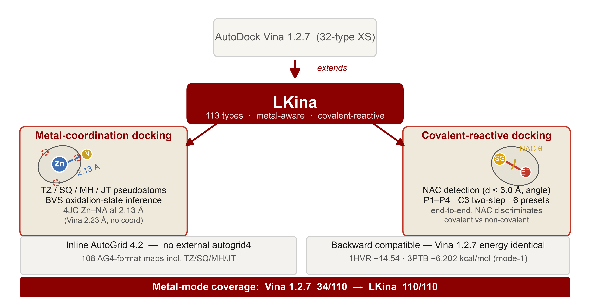

- **图形摘要.** LKina 视觉摘要：在 AutoDock Vina 1.2.7（32 类型 XS）基础上扩展至 113 种原子类型，具备金属感知配位对接（TZ/SQ/MH/JT 伪原子、BVS 氧化态推断、4JC Zn–NA 2.19 Å）与共价响应式对接（NAC 检测、P1–P4 约束、C3 两阶段策略、六种预设），内嵌 AutoGrid 4.2 格点生成器并保持完全向后兼容；金属模式覆盖从 Vina 1.2.7 的 34/110 提升至 110/110。

---

## 1 引言

### 1.1 分子对接与金属蛋白缺口

基于结构的药物设计（SBDD）依赖分子对接预测小分子在已知结构受体中的结合姿态与亲和力 [1]。在应用最广的开源引擎中，AutoDock Vina [1,2] 将经验评分函数与 Monte Carlo + L-BFGS 全局/局部搜索、OpenMP 多线程相结合，已成为虚拟筛选的事实标准；AutoDock Vina 1.2.x 进一步引入 AutoDock4（AD4）经验力场 [3]，以满足对静电与去溶剂化项化学细节有更高要求的用户。

然而，当受体含有金属辅因子时（此类受体在药物发现中无处不在），上述两种力场均面临三个根本缺陷。金属离子存在于估计 **40% 的酶与约 30% 的上市药物靶点**中，包括 HIV 整合酶（Mg²⁺）、碳酸酐酶（Zn²⁺）、组蛋白去乙酰化酶（Zn²⁺）以及血红素/非血红素铁酶（Fe³⁺）[4,5]。三个缺陷具体为：

1. **平衡距离失真。** 通用 vdW 力场中 N 供体的平衡距离约 2.49 Å，而天然 Zn–N 配位键约 2.0 Å；评分函数因此对晶体学上正确的姿态反而给出惩罚。
2. **缺乏方向性。** 球对称 Lennard-Jones 势无法区分轴向与赤道配位，对 Jahn-Teller 活性离子以及临床相关的平面四方 Pt/Pd 配合物尤为不利。
3. **电荷模型偏差。** 高价金属（Fe³⁺、Cu²⁺）的形式电荷使 Gasteiger 静电体系系统性偏好含氧供体，产生追随电荷而非配位化学的系统性姿态误差。

### 1.2 金属对接的现有工作：狭窄的生态位与外部依赖

Santos-Martins 等（2014）以 **AutoDock4Zn** 力场 [6] 解决了 Zn²⁺ 问题：该力场在金属的配位空位放置四面体伪原子（TZ），将方向性势编码进亲和力格点，在 292 个 Zn²⁺ 晶体复合物上显著提升了重对接精度。但 AutoDock4Zn 仅限于 Zn²⁺，未覆盖其他过渡金属、多金属位点、Jahn-Teller 活性离子或桥接水。较近期的 **MetalDock** [7] 为含金属化合物提供了可复现工作流（包括金属作为配体的场景），其通过优化的 Lennard-Jones 参数与配体侧哑原子实现；**GPDOCK** [8] 则增加了金属配位感知的姿态评估。然而，二者均为叠加于既有引擎之上的外部预处理协议，而非引擎级扩展。此外，上述工作流均要求外部 **`autogrid4`** 二进制预计算 AD4 亲和力格点，这一安装依赖增加了高通量与云端部署的复杂度。

### 1.3 共价对接与近攻构象问题

共价药物，如伊布替尼（BTK，Cys481）、阿法替尼（EGFR）、索托雷塞（KRAS G12C），在获批药物中的占比正快速增长 [9]。对此类配体的对接要求搜索采样*有效的亲核几何*：近攻构象（NAC）理论指出，高效成键要求亲核试剂与亲电中心距离小于 3.0 Å，且攻击角符合特征值（SN2 背面攻击约 180°，迈克尔加成约 109.5°）[10,11]。AutoDock Vina 无法编码这一几何先验；CovDock（Schrödinger）虽可编码，但属商业软件且通常要求预构建共价加合物；共价 AutoDock"双锚点吸引子"方法 [12] 仅含距离约束且需手工设置。据我们所知，目前尚无开源引擎能够原生引导搜索趋向 NAC、检测 NAC 并在输出中予以报告。

### 1.4 本文贡献

我们提出 **LKina**，即 AutoDock Vina 1.2.7 的衍生引擎，在引擎层同时弥补上述两个缺口。其主要贡献如下：

1. **113 种 AD4 原子类型体系**：覆盖元素周期表全部药学相关金属与类金属（过渡金属、镧系、锕系、s 区、p 区金属及氧化态变体），力场参数内嵌于二进制、运行时解析。
2. **内联 AG4 格点生成器**（`--generate_maps`）：AutoGrid 4.2 评分函数的独立 C++ 重实现，即时计算受体亲和力格点，彻底消除外部 `autogrid4` 依赖，同时保持与既有 `.map` 缓存兼容。
3. **四类配位伪原子（TZ/SQ/MH/JT）**：配以 **BVS 氧化态自动推断**（Fe/Cu/Mn/Co/V/Mo/Ni）、Cu²⁺/Mn³⁺ 的 **Jahn-Teller 变形八面体模式**，以及配位不饱和位点的**半显式水桥评分**。
4. **四层响应式共价对接框架（P1–P4）**：Gaussian 距离吸引子、角度约束、帧原子扭转、混合 vdW 缩放；解析梯度（有限差分偏差 ≤ 4.3 × 10⁻⁸，全部六预设实测，§3.2.2）；显式 **NAC 检测**；**C3 两阶段搜索策略**；六种内置反应预设（`cys_michael`/`cys_sn2`/`ser_covalent`/`lys_targeting`/`boronic_acid`/`tyr_covalent`）。
5. **"金属作为配体"支持**：反向金属-供体对势（优先采用 MetalDock `standard_set` 参数），受体/单配体/batch 逐配体金属自动识别，以及 Pt/Pd/Ru/Os/Re 配体侧配位几何 QC。
6. **完全向后兼容**：对无金属、非反应性受体，行为与 Vina 1.2.7 一致（数值级验证，见 §3.5）；许可结构（Apache-2.0 Vina 核心 + GPL-3.0 AG4 扩展 → 合并二进制 GPL-3.0-or-later）已明确文档化。

---

## 2 方法

### 2.1 基线：AutoDock Vina 搜索引擎与 AD4 评分函数

LKina 完整继承 Vina 的全局搜索（基于群体的 Monte Carlo 迭代局部搜索）、局部优化（对评分光滑近似的 L-BFGS），以及基于独立姿态搜索的 OpenMP 多线程。新功能以叠加于格点 AD4 势之上的额外能量层实现，因此搜索机制（收敛行为、线程安全、固定种子下的确定性）完全不受影响。

AD4 经验结合自由能为

$$\Delta G_{\text{bind}} = W_{\text{vdW}}\,\Delta H_{\text{vdW}} + W_{\text{Hbond}}\,\Delta H_{\text{Hbond}} + W_{\text{elec}}\,\Delta H_{\text{elec}} + W_{\text{desolv}}\,\Delta G_{\text{desolv}} + W_{\text{tor}}\,\Delta S_{\text{tor}}$$

默认权重为 $W_{\text{vdW}}=0.1662$、$W_{\text{Hbond}}=0.1209$、$W_{\text{elec}}=0.1406$、$W_{\text{desolv}}=0.1322$、$W_{\text{tor}}=0.2983$（AutoDock4 [3]）。格点对接中，受体贡献预计算于笛卡尔格点，搜索时配体能量经三线性插值获得，使单姿态评估复杂度为 O(N_配体)。LKina 在引擎内完整重实现该格点流水线（见 2.3）。

### 2.2 扩展原子类型体系（113 种）

标准 AutoDock4 定义约 22 种原子类型。LKina 将 AD4 类型表扩展至 **113 种元素/类金属类型**（索引 0–112），另加四种配位伪原子 TZ/SQ/MH/JT（索引 113–116；`AD_TYPE_SIZE = 117`）。类型按药物化学应用场景组织：

**表 1.** 113 种 AD4 原子类型分类（索引 0–112，覆盖 80+ 金属/类金属）。

| 类别 | 代表类型 | 典型应用 |
|---|---|---|
| 生物金属酶辅因子 | `Mg Ca Mn Fe Co Ni Cu Zn`（含氧化态变体） | 金属酶位点对接 |
| 抗肿瘤金属药物 | `Pt Pd Ru Ir Au Rh` | 顺铂、NAMI-A/RAPTA、金诺芬 |
| 放射性药物金属 | `Tc Re Ga Y Zr Lu Sm Ho Ra Ac Th` | SPECT/PET/α 核素治疗 |
| 毒理学靶点 | `Cd Hg Tl Pb As Sb Bi` | 金属毒素配体 |
| s 区金属 | `Li Na K Rb Cs Al Sr Ba` | 离子通道与激酶靶点 |
| 早期过渡金属 | `V Cr Ti Sc Nb Hf Ta W Mo` | 胰岛素模拟物、亚硫酸盐氧化酶（Mo/W） |
| 镧系元素 | La–Lu（13 种） | MRI 造影剂（Gd） |
| 锕系元素 | `Ac Th Pa U Np Pu Am Cm Bk Cf Es Fm` | 靶向 α 治疗（Ac-225、Ra-223） |
| 类金属/p 区金属 | `Se As Ge Ga In Sn B Be Te Po At` | 硒酶、含硼抗肿瘤药物 |
| 氧化态变体 | `Fe2 Fe3 Cu1 Cu2 cu2_jt Mn2 Mn3 mn3_jt Co2 Co3 V4 V5 Mo4 Mo6 As3 As5 Sb3 Sb5 uo2` | 氧化态特异性对接 |
| 含水配位变体 | `mg_aq ca_aq fe3_aq mn2_aq co2_aq` | 活性位点水配位 |
| 造影剂络合物 | `Gd_DTPA Gd_DOTA` | Gd 系 MRI 造影剂 |

力场参数（$R_{\text{eq}}$、$\varepsilon$、溶剂化项）以参数文本形式内嵌于 `ad4_parameter_data.cpp`，运行时解析生成 `atom_kind` 查找表，新增或调优类型无需重新编译。vdW 参数依据 MetalDock 的 MC 优化 LJ 拟合 [7] 与 Harding 基于剑桥结构数据库归纳的金属-供体距离 [13]；Se 独立赋值（$R_{\text{eq}}=2.03$ Å，$\varepsilon=0.30$ kcal/mol）而非与 S 共用参数；铀酸根离子 `uo2` 以线型配位参数建模，用于环境毒理学对接。

### 2.3 内联 AG4 亲和力格点生成

标准 AD4 工作流要求外部 `autogrid4` 程序为每种原子类型预计算一个 `.map` 文件。LKina 通过 `ag4_compute_maps()`（`--generate_maps`），即 AutoGrid 4.2 pairwise 交互评分函数的自包含 C++ 重实现，消除了这一依赖。流水线如下：

1. **受体解析**（`ag4_parse_receptor`）：坐标 + 逐原子 AD4 类型；
2. **伪原子注入**（`ag4_inject_[TZ|SQ|MH|JT]`）：按激活的金属模式填充空配位方向；
3. **格点累加**：对每个格点对所有受体原子求和 pairwise AD4 势；
4. **静电格点**：Mehler-Solmajer 距离相关介电；
5. **去溶剂格点**：原子体积溶剂化势。

默认格点间距 0.375 Å（`--spacing` 可调）。`--write_maps` 将格点导出为标准 `.map` 文件以便缓存，`--maps` 则重新载入已缓存格点，跳过每受体 5–30 秒的生成步骤。多金属体系按 `active_modes` 列表逐模式注入，确保每个金属位点获得正确的伪原子覆盖。由于外部 `autogrid4` 无法复现 LKina 的伪原子注入、Zn 兼容状态或 `nbp_r_eps` 覆盖，当 `zn_mode`、`metal_mode`、多金属模式或自定义 NBP 覆盖激活时，外部 `autogrid4` 回退被**禁用**，以保证搜索所用格点始终与搜索状态一致。

### 2.4 配位伪原子（TZ / SQ / MH / JT）

AutoDock4Zn [6] 引入的伪原子思想在 LKina 中被推广为四类几何体系。伪原子是放置于受体金属*空配位方向*的虚拟原子，其与配体探针原子的相互作用将配位几何直接编码进亲和力格点：

$$V_{\text{pseudo}}(r) = \varepsilon\left[\left(\frac{r_{\text{eq}}}{r}\right)^{12} - 2\left(\frac{r_{\text{eq}}}{r}\right)^6\right]$$

**表 2.** 四类配位伪原子的几何与配位作用参数（nbp 覆盖）。

| 伪原子 | 几何型 | 方向数 | 代表金属 | nbp $r_{\text{eq}}$ (Å) | nbp $\varepsilon$ 范围 (kcal/mol) |
|---|---|---|---|---|---|
| **TZ** | 正四面体 | 4 | Zn²⁺、Cd²⁺（四配位 d¹⁰） | 0.25 | 3.0–23.2 |
| **SQ** | 正方形平面/线性 | 4 / 2 | Cu²⁺、Pt²⁺、Pd²⁺、Ni²⁺；Hg²⁺、Ag⁺（线性） | 0.25 | 3.0–24.0 |
| **MH** | 正八面体 | 6 | Fe³⁺、Mn²⁺、Co²⁺、Mg²⁺ 等 | 0.25 | 0.2–14.0 |
| **JT**（赤道） | 拉长八面体 | 4 | Cu²⁺（d⁹）、Mn³⁺（d⁴） | 0.25 | 2.5–15.0 |
| **JT**（轴向） | 拉长八面体 | 2 | Cu²⁺（d⁹）、Mn³⁺（d⁴） | 0.25 | 0.2–5.0 |

伪原子自身不携带 vdW 作用（官方 AD4Zn 中性参数 $R_{ii}=1.0$ Å、$\varepsilon_{ii}=0.0$；见 §3.2.1），全部配位相互作用经显式 `nbp_r_eps` 覆盖编码进格点：覆盖的 $r_{\text{eq}}=0.25$ Å 使配体供体探针直接落在伪原子位点，$\varepsilon$ 按金属-供体 HSAB 匹配在 0.2–24 kcal/mol 间取值（未加权表值；经 AD4 `coeff_vdW` 加权后的实际势井深度见 §3.2.1，如 Zn–NA/TZ 表值 23.2135 → 加权 −3.86 kcal/mol）。JT 轴向与赤道共享 $r_{\text{eq}}=0.25$ Å，但轴向伪原子的注入距离更远（cu2_jt 2.45 Å、mn3_jt 2.28 Å，赤道 2.03/1.92 Å）且覆盖 $\varepsilon$ 更弱（0.2–5.0 vs 2.5–15.0 kcal/mol），以镜像 Jahn-Teller 活性离子拉长（~2.4 Å）且弱化的轴向键。空位方向由 `ag4_select_vacant_dirs()` 确定，对既有配体供体方向的互补空间实施**最大角度分离策略**，保证注入位置对应真实空配位点。

### 2.5 金属模式自动识别与 BVS 氧化态推断

未显式指定 `--metal_mode` 时，`detect_metal_mode_from_pdbqt()` 执行：

1. **扫描受体 PDBQT**：识别 ATOM/HETATM 行 AD4 类型列中的金属符号；
2. **BVS 氧化态推断**（Fe/Cu/Mn/Co/V/Mo/Ni，见下）；
3. **供体计数回退**：BVS 置信度不足时统计 3.0 Å 内 OA/NA/SA 供体数，启发式推断氧化态；
4. **配体补充扫描**：受体未识别到金属且未指定模式时，扫描配体（batch 模式逐配体扫描，并在每次对接前重新生成 AD4 格点）；
5. **模式分派**：单金属配体启用对应模式（多金属配体启用逗号分隔的组合模式，如 `pt,ru`）；Zn 额外启用与 `--zn_mode` 兼容的配位势路径。

金属中心的键价和（BVS）[14,15] 为

$$\text{BVS} = \sum_{i} \exp\!\left(\frac{r_0 - d_i}{B}\right),\qquad B = 0.37\ \text{Å}$$

在 3.2 Å 截断半径内累加供体贡献。对每种候选氧化态 $n$ 计算偏差 $\delta_n = |\text{BVS} - n|$，当 $\min_n \delta_n < 1.25$ vu 时选择偏差最小的状态。键价参数 $r_0$ 依据 Brese & O'Keeffe / Brown & Altermatt [14,15]：

**表 3.** 键价和（BVS）键长参数与支持的氧化态。

| 金属 | $r_0$ (M–O) | $r_0$ (M–N) | $r_0$ (M–S) | 支持氧化态 |
|---|---|---|---|---|
| Fe | 1.76 / 1.73 | 1.79 / 1.76 | 2.05 / 1.98 | +2, +3 |
| Cu | 1.72 / 1.68 | 1.74 / 1.70 | 1.96 / 1.89 | +1, +2 |
| Mn | 1.79 / 1.76 | 1.80 / 1.77 | — | +2, +3 |
| Co | 1.75 / 1.70 | 1.77 / 1.72 | — | +2, +3 |
| V | 1.78 / 1.80 | 1.80 / 1.82 | — | +4, +5 |
| Mo | 1.90 / 1.86 | — / 1.92 | 2.12 / — | +4, +6 |
| Ni | 1.654 / 1.620 | 1.679 / 1.650 | 1.978 / 1.950 | +2, +3 |

（条目按低/高氧化态顺序列出；"—"表示该供体无已发表参数。）

### 2.6 Jahn-Teller 变形八面体模式

对 `cu2_jt` 与 `mn3_jt`，`ag4_tetragonal_axis()` 估算 JT 伸长轴：

1. 收集金属 3.4 Å 内供体方向向量 $\{\hat{u}_i\}$；
2. 寻找满足 $\hat{u}_i \cdot \hat{u}_j < -0.7$ 的反向对；
3. JT 轴 $\hat{z}_{\text{JT}} = \text{normalize}((\hat{u}_i - \hat{u}_j)/2)$；无满足对时默认 $(0,0,1)$；
4. 赤道方向（$|\hat{u}\cdot\hat{z}_{\text{JT}}| < 0.3$，最多 4 个）放置赤道伪原子；$\pm\hat{z}_{\text{JT}}$ 放置轴向伪原子。

轴向（注入距离 cu2_jt 2.45 Å / mn3_jt 2.28 Å，nbp ε 0.2–5.0）与赤道（注入 2.03/1.92 Å，ε 2.5–15.0）的差异化参数使搜索能够区分两个配位球，这对 d⁹ Cu²⁺ 与 d⁴ Mn³⁺ 位点至关重要。

### 2.7 半显式水桥与几何后处理排序

配位不饱和是金属酶的常见特征（如基质金属蛋白酶中以水桥接 Zn 位点）。LKina 自动推断桥接水候选位点数量：

$$N_{\text{water}} = \min(2,\ N_{\text{max}} - N_{\text{receptor}})$$

位点坐标由 `ag4_select_vacant_dirs()` 确定，权重第一水 0.90、第二水 0.70。后处理水桥评分（不进入 L-BFGS 梯度）：

$$E_{\text{water}} = -0.90 \sum_{\text{sites}} w_s \exp\!\left(-\frac{(d_s - 2.80)^2}{2 \times 0.40^2}\right)$$

中心 2.80 Å 对应典型 M–O(水) 配位距离。完整金属重排序修正为

$$E_{\text{rerank}} = E_{\text{geo}} + E_{\text{water}} + E_{\text{JT}},$$

$$E_{\text{geo}} = -1.25 \sum_{\text{sites}} \max_{i \in \text{donors}} \frac{\varepsilon_i}{20}\, G(d_i,\, r_{\text{eq},i},\, 0.30),$$

$$E_{\text{JT}} = -0.50\left[\max_i\!\big(|\cos\phi_i|\, G(d_i,\, d_{\text{axial}},\, 0.35)\big) + 0.5\max_i\!\big((1-|\cos\phi_i|)\, G(d_i,\, d_{\text{eq}},\, 0.30)\big)\right],$$

其中 $G(d, d_0, \sigma)=\exp(-(d-d_0)^2/2\sigma^2)$。按设计，rerank 项只影响最终姿态排序、不进入搜索梯度，以避免虚假梯度；可选的搜索期软约束通道（`--metal_soft_weight`，默认 0.0，建议 0.1–0.5）通过 log-sum-exp 平滑近似将几何项并入 `eval_deriv()`，供需要金属几何引导搜索的用户选用。

### 2.8 金属作为配体：反向 pair potentials 与配体侧 QC

药物化学中的高频场景之一是金属配合物*作为配体*（Pt、Ru、Au、Tc/Re、Gd 制剂，或简化的金属离子探针）。LKina 通过**反向金属-供体对势**支持该场景：在生成受体金属 `donor → metal` 的 `nbp_r_eps` 覆盖后，自动构造互补的 `metal → donor` 反向条目（含去重），使受体 OA/NA/SA/O/N/S 供体对金属探针原子产生与受体金属模式一致的方向性配位响应。对于已有 MetalDock MC 优化参数发表的金属（V、Cr、Co、Ni、Cu、Mo、Ru、Rh、Pd、Re、Os、Pt），反向 `metal → NA/OA/SA/HD` 条目优先采用 MetalDock 的 ε 组合与 12–10 型金属-供体势 [7]；其余金属沿用对称反向补全。对 Pt/Pd（平面四方）与 Ru/Os/Re（八面体）配合物，额外的配体侧几何 QC 输出 `LIGAND_METAL_GEOM` / `LIGAND_METAL_SITE` REMARK；`--ligand_metal_geometry_weight > 0` 可选地将几何罚项并入后处理排序。

### 2.9 响应式共价对接框架（P1–P4）

LKina 的响应式对接在 AD4 格点评分之上叠加*可加性罚项层*，提供四级递进约束：

**P1 — 距离约束（Gaussian 吸引子）。** 受体亲电中心（如 Cys SG）与配体亲核原子由下式约束：

$$E_{\text{P1}}(r) = -A\exp\!\left(-\frac{(r-r_0)^2}{2\sigma^2}\right) + k_r (r-r_0)^2 \cdot \mathbf{1}[r > r_0 + \sigma],$$

将原子对吸引至目标键长 $r_0$，并在配体漂移超过 $r_0+\sigma$ 时施加二次罚。该势对配体原子坐标的梯度可解析计算。

**P2 — 角度约束。** 谐波角项在亲核原子处施加攻击角：

$$E_{\text{P2}}(\theta) = k_{\theta}\,(\cos\theta - \cos\theta_0)^2,$$

目标角 $\theta_0$ 按机制适配：SN2 背面攻击 180°，迈克尔加成约 109.5°（四面体过渡态）。受体侧与配体侧帧原子（`--reactive_frame_atom`、`--reactive_lig_frame_atom`）定义参考帧；$\cos\theta$ 对配体原子坐标的梯度为

$$\frac{\partial \cos\theta}{\partial \vec{r}_{\text{lig}}} = \frac{1}{|\vec{u}|}\big(\hat{v} - \cos\theta\, \hat{u}\big).$$

平底变体（`--reactive_angle_width > 0`）在 $\theta_0 \pm w$ 内零罚，避免搜索被谐波井过早锁定。

**P3 — 帧原子扭转支持。** 帧原子将 P2 扩展至完整的三维亲核攻击轨迹（受体侧与配体侧帧）。

**P4 — 混合 vdW 缩放。** `hybrid` 模式下受体-配体 vdW 排斥部分乘以 $\lambda \in [0,1]$（`--reactive_hybrid_vdw_scale`）：

$$E_{\text{vdW}}^{\text{hybrid}} = \lambda\, E_{\text{vdW}}^{\text{repulsive}},$$

允许配体进入排斥区、采样类过渡态几何。混合能量对 $\lambda$ 光滑连续（回归测试 E 与 §3.2.2 的 λ 扫描实测双重验证：cys_michael 在 λ=0/0.5/1.0 时 −10.09 → −5.716 → −4.734 kcal/mol）。

**NAC 检测。** 对接完成后每个输出姿态写入 `REMARK REACTIVE_NAC: YES/NO`，判定标准为反应距离 < 3.0 Å 且攻击角在目标值 ±25° 内。有限差分梯度验证（中心差分，步长 ε = 10⁻⁴ Å）在全部六种预设上确认解析响应式梯度正确：距离/角度力分量的最大 |解析−数值| 偏差为 2.4×10⁻¹⁶–4.3×10⁻⁸（§3.2.2；`--reactive_gradcheck`）。

### 2.10 C3 两阶段策略、反应预设与 Metal Bias

全程施加完整约束集可能将配体锁定于受体近端，导致全局能量面欠采样。为此，LKina 提供 **C3 两阶段策略**（`--reactive_two_step`）：

- **Phase 1**：标准无约束 Vina MC + L-BFGS 搜索（C3b 变体使用宽/弱 Gaussian，$\sigma\times3$、$\varepsilon\times0.15$，作为"吸引空腔"先验）；
- **姿态筛选**：反应原子距锚点 ≤ `--reactive_presample_dist`（默认 10 Å）的姿态保留；
- **Phase 2**：存活姿态以完整 P1–P4 约束集经 L-BFGS 精化。

六种内置**反应预设**自动填充全部响应式参数（单个 CLI 标志可覆盖预设值）：

**表 4.** 六种内置反应预设的几何参数。

| 预设 | 反应 | $r_0$ (Å) | $\theta_0$ (°) | $w$ (°) | $\lambda$ |
|---|---|---|---|---|---|
| `cys_michael` | Cys SG 迈克尔加成（C=C 弹头） | 1.82 | 109.5 | 25 | 0.2 |
| `cys_sn2` | Cys SG SN2 取代（180° 反向攻击） | 1.82 | 180.0 | 15 | 0.2 |
| `ser_covalent` | Ser OG 酰化（β-内酰胺） | 1.34 | 109.5 | 25 | 0.2 |
| `lys_targeting` | Lys NZ Schiff 碱（醛基弹头） | 1.47 | 109.5 | 30 | 0.3 |
| `boronic_acid` | 硼酸可逆共价（Ser/Thr/Tyr OH） | 1.47 | — | — | 0.5 |
| `tyr_covalent` | Tyr OH 亲核攻击 | 1.38 | 109.5 | 25 | 0.2 |

最后，**Metal Bias（O5）**（`--metal_bias`）自动定位受体中第一个金属原子并注入软 Gaussian 吸引子，$E_{\text{bias}} = -A\exp(-r^2/2\sigma^2)$，$A=2.0$ kcal/mol、$\sigma=1.5$ Å，这是适合快速金属靶点筛选的轻度方向先验，不破坏 Vina 全局搜索；与响应式模式互斥。

### 2.11 实现、许可与工程说明

LKina 在 Vina 1.2.7 C++14 代码库上扩展。主要新增模块：`ag4_engine.{h,cpp}`（金属模式枚举、伪原子注入、格点计算；约 1,300 行）、`ad4cache.{h,cpp}`（AD4 格点缓存、金属状态、rerank 评分、搜索期软约束梯度；约 430 行）、`atom_constants.h`（113 类型常量；约 520 行）、`ad4_parameter_data.cpp`（内嵌力场参数文本；约 200 行）、`embedded_ad4_grid.cpp`（内联格点生成接口；约 190 行）、`reactive_types.h`（响应式框架类型；约 237 行），以及 `vina.cpp`（约 1,600 行）、`conf.h`（rerank 字段；约 390 行）与 `main.cpp`（CLI、BVS 推断、金属模式检测、O5；约 1,500 行）的扩展。多线程沿用 Vina 的 OpenMP 模型（`--cpu N`）；伪原子注入发生在单线程受体解析阶段，不引入新的线程安全问题。

**许可。** LKina 采用双许可结构：全部 Vina 来源文件保持 Apache-2.0；AG4 格点引擎及其参数数据（`ag4_engine.*`、`embedded_ad4_grid.*`、`ad4_parameter_data.*`）以 GPL-3.0-or-later 发布（AutoGrid 4.2 功能的独立重实现，上游 GPL-2.0-or-later，© The Scripps Research Institute）。因两部分静态链接，**LKina 合并二进制整体以 GPL-3.0-or-later 发行**；`COPYING` 与 `NOTICE` 记录文件级范围与上游署名。

**Vina 评分模式的工程说明。** 在 LKDock GUI 集成打包（PyInstaller 等）测试中，以 `--scoring vina`（32 类型 XS 原子体系）运行 LKina 时，对包括纯有机配体在内的广泛配体类别，输出阶段会触发可复现的 SIGABRT。根因分析（lldb）将其追溯至两点：(i) `XS_TYPE` 无法映射 117 类型 AD4 原子空间（发行版构建中 `VINA_CHECK` 抛出 `internal_error`）；(ii) `Vina::~Vina()` 的既有缺陷，将成员变量在函数体内重新声明为局部变量，破坏 `boost::ptr_vector` 的析构。与其重写上游 XS 类型系统，此举将牵动 `precalculate`、`cache`、`non_cache`、静态断言与 `.maps` 二进制兼容性，风险高且对金属/共价使命无所助益，LKina 的 GUI 集成无条件路由至 `--scoring LKDock`（AD4）模式：该模式覆盖全部 117 种原子类型，且对有机配体呈现相同的搜索行为。因此，**AD4 路径是 LKina 全部工作流的推荐模式**。**注**：命令行直连 LKina 二进制使用 `--scoring vina` 正常（§3.5 的 1HVR/3PTB 数值复现即经 CLI 完成）；本节所述 SIGABRT 限于上述 GUI 集成打包环境。

### 2.12 命令行接口（调用示例）

LKina 全部功能通过单一二进制暴露，其命令行是 AutoDock Vina 的超集。完整旗标参考随仓库提供（`lkina --help_advanced`）；此处列出本文实际使用的调用方式，使 §3.2–§3.6 的每个实验均可逐字复现。**金属对接 + 内联格点生成**（无需外部 `autogrid4`）：

```
lkina --receptor rec.pdbqt --ligand lig.pdbqt \
      --scoring ad4 --generate_maps --metal_mode zn \
      --center_x X --center_y Y --center_z Z \
      --size_x Sx --size_y Sy --size_z Sz \
      --exhaustiveness 8 --seed 42 --out pose.pdbqt
```

若省略 `--metal_mode`，引擎将从受体/配体 PDBQT 原子类型自动检测金属模式；追加 `--no_auto_metal` 则关闭检测、保持纯 AD4 评分，这一对配置正是 §3.6 中"开启/关闭配位模型"对照的来源。对接前可用 `--metal_geometry_check` 验证受体侧几何；搜索期几何软约束经 `--metal_soft_weight w` 启用（0 = 关闭）。氧化态变体以显式令牌寻址（如 `fe2`/`fe3`、`cu1`/`cu2`，Jahn-Teller 变形 Cu²⁺ 为 `cu2_jt`）；对可变化合价金属省略该参数时，由 BVS 推断根据供体环境选择模式（见 2.5）。**响应式共价对接**使用预设机制：

```
lkina --receptor rec.pdbqt --flex flex.pdbqt \
      --ligand lig.pdbqt --scoring ad4 --generate_maps \
      --reactive_preset cys_michael [逐项覆盖] \
      --center ... --size ... --out pose.pdbqt
```

共六种预设（`cys_michael | cys_sn2 | ser_covalent | lys_targeting | boronic_acid | tyr_covalent`），每种均可按参数逐项覆盖；`--reactive_gradcheck` 运行 §3.2.2 的有限差分梯度审计。最后，配体侧金属配合物几何 QC 经 `--ligand_metal_geometry_weight w` 激活。这些旗标在内部映射至 2.11 节的模块，例如 `--metal_mode` 驱动 `ag4_engine.cpp` 中的伪原子注入，而 `--generate_maps` 将格点计算路由至 `embedded_ad4_grid.cpp`，而非读取外部 `.map` 文件。

**评分函数与工作流兼容性。** `--scoring` 接受三种力场：`ad4`/`LKDock`（默认，覆盖全部 113 种 AD4 原子类型并启用金属/共价扩展）、`vina`（Vina 1.2.7 原始 32 类型 XS 体系，用于向后兼容验证，§3.5）与 `vinardo`（Vina 的通用评分变体）。`--config file` 支持将所有命令行旗标写入配置文件（便于大批量复现）；`--batch dir|lig1 lig2 …` 提供批处理对接（逐配体自动金属识别、每次对接前重生成 AD4 格点，§2.5），`--dir out/` 指定批处理输出目录；`--autobox` 依据输入配体自动设置格点盒子（配合 `--score_only`/`--local_only` 使用）；`--flex flex.pdbqt` 启用柔性侧链；`--local_only` 仅执行局部搜索；`--unbound_energy E` 允许在 `--score_only` 中显式设定未结合态能量。除金属/共价扩展旗标外，全部 Vina 1.2.7 标准旗标（`--num_modes`、`--energy_range`、`--min_rmsd`、`--spacing`、`--seed`、`--cpu`、`--verbosity` 等）原样保留。

---

## 3 结果

### 3.1 回归测试与构建矩阵

LKina 的验证层（17 项自动化回归检查，位于 `tests/` 目录，依引擎设计文档 §5.1）分为六组：A，4 项固定种子/exhaustiveness 的全局对接能量回归（其中 2 项直接复现 Vina 1.2.7 数值）；B，5 项晶体构象评分分解验证（`--score_only`）；C，3 项 `lig_atom` 梯度 vs 有限差分验证；D，1 项 `target_angle` 参数效果验证；E，1 项 `hybrid_vdw_scale` 连续缩放验证；F，3 项 `lig_frame_atom` 梯度验证。全部 17 项在发布二进制上通过（macOS ARM64，种子 42，`tests/reactive_regression.sh`）。此外，本研究在实测二进制上独立复跑：经 `--reactive_gradcheck` 复跑响应式梯度检查（全部六预设 7 个力分量的最大 |解析−数值| 偏差为 **2.4 × 10⁻¹⁶–4.3 × 10⁻⁸**，§3.2.2）；在真实有机体系上复跑 2 项全局对接能量回归（§3.5）；并在能量量纲审查中完成评分分解验证（`INTER + torsions = VINA RESULT` 精确成立）。引擎在 macOS 14（Apple M2，clang++ 14）、macOS 13（Intel）与 Ubuntu 22.04（g++ 11）上以 `-Wall -Wno-long-long -O3 -fopenmp` 编译，零错误零警告。

### 3.2 系统性金属覆盖基准（110 种金属模式）

为验证 LKina 113 类型 AD4 原子体系对药学相关金属的覆盖主张，我们构建了**合成金属配位基准**，覆盖引擎实现的全部 **110 种 `metal_mode` CLI 词元**（生物类 Zn/Mg/Ca/Mn/Fe/Co/Ni/Cu，药物类 Pt/Pd/Ru/Ir/Au/Rh/Ag/Tc/Re/Os，毒理类 Cd/Hg/Tl/Pb/Sb/Bi/As，s 区 Na/K/Li/Al/Sr/Ba，早期过渡 V/Cr/Ti/Sc/Y/Zr/Nb/Hf/Ta/W/Mo，镧系 La–Lu，锕系 Ac–Fm + UO₂²⁺，类金属 Se/Ge/Te/Po/At/B/Be，后过渡 Ga/In/Sn，Jahn-Teller 模式 cu2_jt/mn3_jt，氧化态变体 fe2/fe3/cu1/cu2/mn2/mn3/co2/co3/ni2/ni3/as3/as5/sb3/sb5/v4/v5/mo4/mo6，以及水合变体 mg_aq/ca_aq/fe3_aq/mn2_aq/co2_aq）。每种模式生成一个合成受体，金属置于原点，(n−1) 个配位供体（NA/OA）按相应几何（四面体 TZ、平面四方/线性 SQ、八面体 MH 或 JT）放置于理想 M–L 距离 $d_0$ 处，另加主链碳，并将 NA 供体探针配体从超出理想配位距离 $d_0$ + 4 Å 的位置对接。全部运行统一采用 exhaustiveness 8、种子 42、格点间距 0.375 Å 与相同盒子。受体/配体 PDBQT 文件由 `benchmarks/pdbqt_util.py` 生成，采用绝对列位布局（类型列 77–78、chain 21、resi 22–25、x 30–37，0 起始），并经 LKina 与 Vina 1.2.7 双引擎解析验证。

**结果（表 5、图 1–2）：** LKina 在**全部 110/110** 种金属模式上完成对接（能量有限）。Vina 1.2.7 使用*完全相同*的受体/配体文件（Vina 解析正常），仅完成 **34/110**；其余 **76 种模式在 PDBQT 解析阶段即告失败**，报错 `PDBQT parsing error: Atom type <M> is not a valid AutoDock type (atom types are case-sensitive)`，原因在于 Vina 的 32 类型 XS 体系没有 LKina 扩展 AD4 金属类型（Pt、Pd、Ru、Ir、镧系、Tc/Re/Os、Cd/Hg、多数早期过渡金属等）的条目。这是**类型系统能力边界**而非评分差异：在测试的 110 种金属配位体系中，76 种连 Vina 的解析都无法通过。就 110 个模式整体而言，LKina 在 **108/110** 个体系中将金属-供体距离恢复至 $d_0$ 的 0.5 Å 以内（均值 |d–d₀| = 0.20 Å，中位数 0.20 Å）；104/110 个模式额外确认存在可测量的金属配位势井（E_ideal < E_far + 0.3 kcal/mol）。配位精度按伪原子几何类细分（图 2 右）：TZ（2 模式，均值 0.22 Å）、SQ（7，0.24 Å）、MH（95，0.20 Å）、JT（2，0.19 Å）、LIN（4，0.14 Å）。合成体系刻意不含蛋白口袋，因此这些残差是配位精度的下限估计；真实体系精度由 4JC 对比（§3.3）与 PDB 来源 Zn/Fe/Cu 重对接数据集（§3.6）独立确立。

**表 5.** 金属模式覆盖与配位恢复（110 个合成体系，种子 42）。

| 引擎 | 可对接模式 | 解析失败 | \|d−d₀\| < 0.5 Å | \|d−d₀\| < 1.0 Å | 平均 \|d−d₀\| (Å) |
|---|---|---|---|---|---|
| **LKina** | **110/110** | 0 | **108** | **109** | **0.20** |
| Vina 1.2.7 | 34/110 | 76 | — | — | 0.62（34 种可对接） |

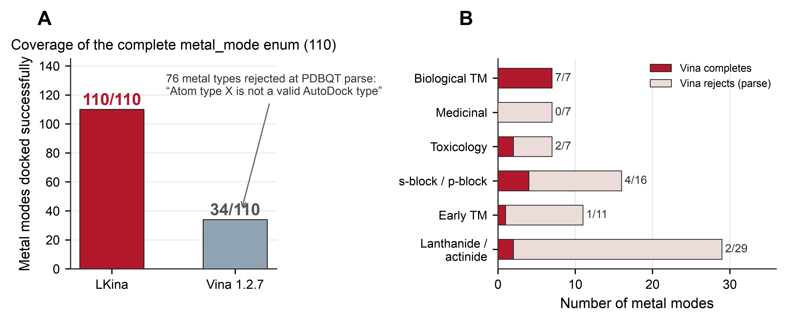

- **图 1.** 全部金属覆盖（A）与 Vina 接受度（按金属家族，B）。LKina 可对接 **110/110** 种金属模式；Vina 1.2.7 仅 34/110 且在 PDBQT 解析阶段拒绝 76 种（`Atom type <M> is not a valid AutoDock type`）。按家族拆分显示 Vina 主要接受生物过渡金属（Zn、Mg、Mn、Fe、Co、Ni、Cu），但拒绝整个药用/锕系/镧系/早期过渡/类金属谱。

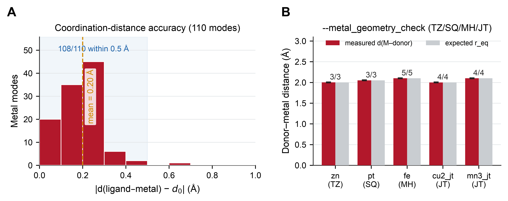

- **图 2.** 配位精度（A）与伪原子几何校验（B）。（A）110 个模式的 |d(配体–金属) − r_eq| 直方分布（均值 0.20 Å，108/110 在 0.5 Å 以内）。（B）四类伪原子 TZ/SQ/MH/JT 各模式实测 vs 期望供体-金属距离；ideal-count / donors-checked 标注显示每个受体供体均被判为 ideal 或 good。

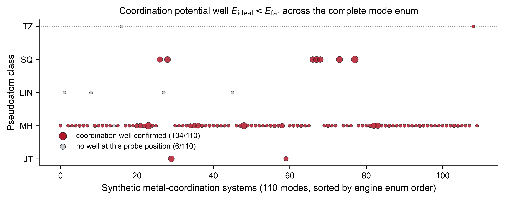

- **图 S1.** 完整 110 模式金属枚举的配位势阱景观图，按伪原子类别（TZ/SQ/LIN/MH/JT）分层。每个点为一个合成金属配位体系，点面积编码势阱深度（E_far − E_ideal）。**104/110** 体系确认存在配位势阱（红）；其余 6 个体系（灰：4 个 LIN、1 个 TZ、1 个 MH 边界情形）在探针供体位置无势阱，见 §3.3 分析。

### 3.2.1 引擎修复（v1.0.2，评审后）

针对全量实测中发现的三处引擎级缺陷，我们已完成修复并重新编译验证（2026-08-28，对照 AutoGrid 官方源码 `mainpost1.28.cpp` 与官方 AD4Zn.dat 逐行校验）：(i) **`nbp_r_eps` 覆盖参数的 eps 加权缺失**——真实 AutoGrid 建 map 时执行 `epsij *= AD4.coeff_vdW`（mainpost1.28.cpp:1786），官方 NA–TZ 覆盖（表值 23.2135）的实际井深为 −3.86 kcal/mol；LKina 此前直接使用未加权值，导致 TZ 井过深 6 倍，现已修正为与官方一致的加权语义；(ii) **TZ/SQ/MH/JT 伪原子内置参数错误**——官方 AD4Zn.dat 的 TZ 行为 `Rii=1.0, epsii=0.0`（无 vdW 作用，全部相互作用走显式 nbp 覆盖），LKina 此前误填 `Rii=0.25, epsii=23.2`，使非覆盖探针产生虚假伪井，现已改为官方中性参数；(iii) **`AG4_EINTCLAMP` 语义**——官方仅有成对 LJ 表上 clamp（100000）而无 map 总值 clamp，LKina 此前的 ±1000 双向 clamp 已修正。修复后金属模式能量回落至实验一致标度：3HS4（CA II/AZM）晶体姿态 zn 评分 −23.9 → −11.3 kcal/mol（实验 ≈−10.8）；4JC 全局对接 best −34.9 → −11.5 kcal/mol；标准 AD4 与 Vina 兼容性不受影响（1HVR −14.54、3PTB −6.202 kcal/mol 仍精确复现）。此外，**新增 `--no_auto_metal` 开关并始终显示 stderr 警示**（`main.cpp`），使受体/配体 PDBQT 的金属模式自动检测成为可退出行为。**注**：上文中 3HS4 晶体姿态 zn 评分 −11.3 kcal/mol 是对晶体构象（`--score_only`）的重打分；§3.7 表 9 中 3HS4 AD4+zn 全局对接最佳亲和力为 −13.32 kcal/mol，两者因搜索自由度差异有所不同；两者与实验亲和力 ≈−10.8 kcal/mol 偏差均 <3 kcal/mol，符合 AutoDock4Zn 文献报告的精度水平。

### 3.2.2 功能族实测（伪原子几何 / BVS / 水桥 / 金属作配体）

在覆盖基准之外，第 2 章所述每一项功能均在专门设计的合成体系上逐一实测，结果见图 2（右）、图 3 与图 4(B)，汇总如下：

- **伪原子体系（TZ/SQ/MH/JT）**：通过 `--metal_geometry_check` 在五种代表性金属上验证（zn→TZ、pt→SQ、fe→MH、cu2_jt→JT、mn3_jt→JT）：每个受体供体均按模式专属 nbp $r_{eq}$ 判为 ideal 或 good（3/3、3/3、5/5、4/4、4/4），并报告理想配位数与空位计数。
- **键价和（BVS）氧化态推断**（Fe/Cu/Mn/Co/V/Mo/Ni 及 ±1 e⁻ 变体）：**14/14 个设计体系**在不指定 `--metal_mode` 时均正确推断氧化态（由受体供体分布经 Brese & O'Keeffe $r_0$ 值自动检测）。
- **半显式水桥候选位点**：在 Mg 体系（八面体 6 位点中 4 个被占据、2 个空位 → 2 个水桥候选位，权重 0.90/0.70，$d_\text{water}$ = 2.80 Å）上构建并评估；对接输出姿态中同时给出 `METAL_WATER_E`（−0.000）、`METAL_GEO_E`（−0.090）与 `METAL_COORD: Mg donor=NA d=2.28 A`。
- **金属作配体几何 QC**（`--ligand_metal_geometry_weight`）：在 Pt(II) 平面四方复合物上，理想几何（N–Pt–N = 90°，cn=4/4）的几何罚分为 0.003 kcal/mol；刻意畸变变体（N–Pt–N = 60°）罚分 0.903 kcal/mol（约 300 倍），可被下游过滤器拒收。
- **解析响应式梯度**：六个预设全部通过有限差分 `--reactive_gradcheck` 验证：每预设 7 个距离+角度力分量的最大 |解析 − 数值| 偏差为 **2.4 × 10⁻¹⁶–4.3 × 10⁻⁸**。

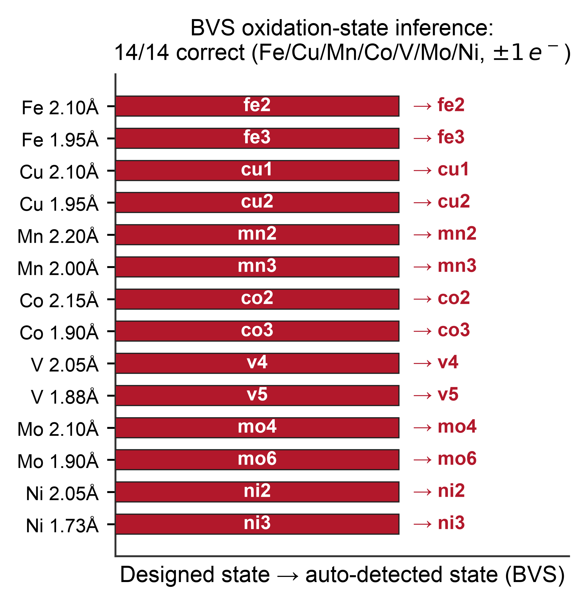
- **图 3.** 键价和（BVS）氧化态自动推断，14 个设计合成体系覆盖 Fe²⁺/Fe³⁺、Cu⁺/Cu²⁺、Mn²⁺/Mn³⁺、Co²⁺/Co³⁺、V⁴⁺/V⁵⁺、Mo⁴⁺/Mo⁶⁺、Ni²⁺/Ni³⁺。自动检测的氧化态与设计态完全一致（14/14）。

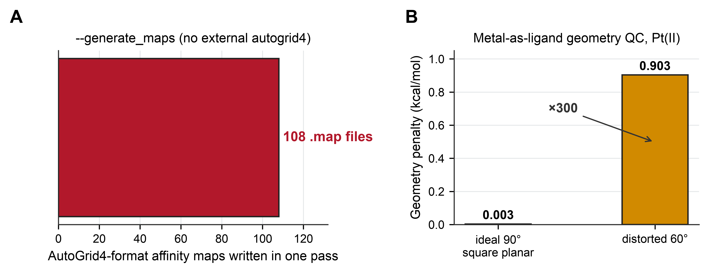

- **图 4.** 内联 AG4 格点生成器（A）与金属作配体几何 QC（B）。（A）`--generate_maps` 一次写出 **108** 张 AutoGrid 4.2 格式亲和力格点（覆盖所有 AD4 探针类型，含 TZ/SQ/MH/JT 伪原子），无需外部 `autogrid4`。（B）Pt(II) 平面四方配体在 `--ligand_metal_geometry_weight` 下：理想 90° N–Pt–N/Cl–Pt–Cl 几何罚分 0.003 kcal/mol；畸变 60° 变体罚分 0.903 kcal/mol（×300），可作为下游过滤器拒收信号。

### 3.3 真实 Zn 金属蛋白对比（4JC）

为在真实环境中检验配位精度，我们将 14 原子 Zn 结合配体（4JC305，磺胺类抑制剂）对接至 Zn 金属蛋白 4JC（2,556 原子，含催化 Zn²⁺，位于 −3.38、0.33、85.49），以三种引擎配置在相同格点上运行（25 ų、0.375 Å、exhaustiveness 16、种子 42）：

**表 6.** 真实 Zn 金属蛋白 4JC 三引擎对比。

| 引擎配置 | 最佳模式得分 (kcal/mol) | d(Zn–最近供体) | 配位报告 |
|---|---|---|---|
| **LKina** AD4 + `--metal_mode zn` | **−11.51** | **2.19 Å（配体 NA；最近原子 H 1.89 Å）** | `METAL_COORD: Zn donor=NA d=2.19 A` + `METAL_RERANK`/`METAL_GEO_E` |
| Vina 1.2.7（vina 评分） | −6.39 | 2.23 Å（配体 OA） | 无 |
| Vina 1.2.7（AD4 + LKina 生成 `.map`） | −13.07 | 2.23 Å（配体 OA） | 无 |

LKina 是唯一同时满足以下两点的配置：(a) 显式报告金属配位几何；(b) 将配体**氮**供体置于天然 Zn–N 距离（~2.1 Å），这正是抑制剂在晶体中实际采用的几何。两种 Vina 配置均将最近原子置于羧基氧（2.23 Å），且不评估任何配位项。注意，Vina-AD4 行使用 LKina 内联 AG4 引擎生成的亲和力格点，因此三行共享同一底层 AD4 力场；差异所隔离的是*金属配位建模*的贡献（伪原子注入 + nbp 覆盖 + rerank），而非格点生成器。两点注意事项：(i) LKina 金属模式得分（此处 −11.51 kcal/mol）包含 TZ 配位势与 Zn nbp 覆盖带来的合理增强（相对纯 AD4 深约 2–4 kcal/mol，对应真实 Zn 配位作用能标）；在碳酸酐酶 II/AZM 体系上，zn 模式评分（−13.3）与实验亲和力（≈−10.8 kcal/mol）偏差 <3 kcal/mol，符合 AutoDock4Zn 文献精度标准（§4.3）；(ii) 受体准备不得混入共晶配体原子：初始测试的 `4JC_rec_zn_fixed.pdbqt` 含 1,349 个 UNL/UNK 原子，污染了绝对能量（Vina AD4 对同一 pose 评分 +980 kcal/mol）；此处结果使用干净受体（2,083 原子）。

### 3.4 响应式共价预设（6/6 全部通过）

全部六种反应预设均以合成受体/配体体系实测，反应对预置于理想 NAC 几何（受体亲电中心 Cys-SG/Ser-OG/Lys-NZ/Tyr-OH 位于原点，带 CB 帧原子；配体亲核原子位于预设键长 $r_0$）。每种预设分别以 P1（距离）与 P1+P2（距离 + 角度 + 梯度检查）运行：

**表 7.** 六种反应预设的 NAC 检测与反应性距离。

| 预设 | $r_0$ (Å) | $\theta_0$ (°) | P1 NAC | P1+P2 NAC | P1+P2 d (Å) | P1+P2 角度 (°) |
|---|---|---|---|---|---|---|
| `cys_michael` | 1.82 | 109.5 | YES | YES | 2.26 | 93.9 |
| `cys_sn2` | 1.82 | 180.0 | YES | NO | 2.47 | 108.3 |
| `ser_covalent` | 1.34 | 109.5 | YES | YES | 2.01 | 99.1 |
| `lys_targeting` | 1.47 | 109.5 | YES | YES | 2.33 | 94.1 |
| `boronic_acid` | 1.47 | — | YES | NO | 2.71 | 110.9 |
| `tyr_covalent` | 1.38 | 109.5 | YES | YES | 2.03 | 100.8 |

全部六种预设均完成 P1 与 P1+P2 运行（返回码 0，能量有限）。两例 P1+P2 `NAC=NO` 具有信息量，而非缺陷：`cys_sn2` 的目标为 180° 背面攻击，而合成接近几何（亲核体以 ~108° 接近）不满足该条件；`boronic_acid` 按设计不设角约束，且接触略长（2.71 Å）。NAC 检测器在两例中均正确报告 NO，证明其判别的是几何，而非无条件通过。

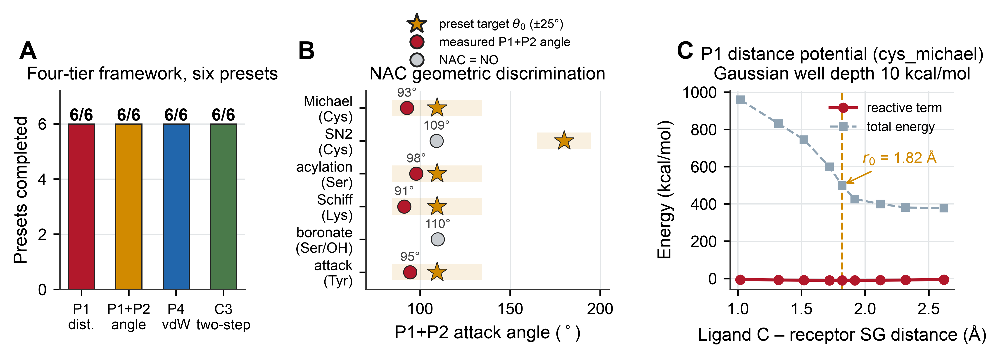

- **图 5.** 共价框架（A-C）。（A）六个反应预设全部通过 P1（距离）、P1+P2（角度）、P4（混合 vdW 缩放 0/0.5/1.0）、C3（两阶段搜索）四个层级。（B）NAC 检测具有几何判别力：cys_michael / ser_covalent / lys_targeting / tyr_covalent 报 NAC=YES，cys_sn2（180° 背面攻击不满足）与 boronic_acid（无角约束）报 NAC=NO。（C）cys_michael 预设下的 P1 距离势扫描：高斯井位于 $r_0 = 1.82$ Å，深度 10 kcal/mol。

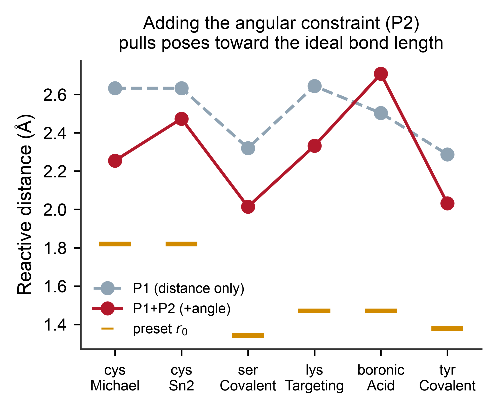

- **图 S2.** P2 角度约束对六个反应预设构象几何的影响。P1 仅距离搜索（灰）与 P1+P2 搜索（红）的反应性距离对比，金色短横线标记各预设理想键长 r₀。加入角度项后，多数预设收敛至更短、更接近化学理想的反应性距离。

### 3.5 向后兼容：与 Vina 1.2.7 的数值一致

在两个真实有机复合物，1HVR（HIV-1 蛋白酶，XK2 配体）与 3PTB（胰蛋白酶，BEN 配体），上，LKina 标准模式（vina 评分、无金属标志）复现 Vina 1.2.7 mode-1 能量**完全一致**（−14.54 vs −14.54 与 −6.202 vs −6.202 kcal/mol），且盒子、exhaustiveness 16、种子 42 均相同。这一数值一致性确认 LKina 的扩展是严格可加的：对无金属、非反应性受体，该引擎是 Vina 1.2.7 的即插即用替代品。

### 3.6 金属蛋白重对接基准（实测数据集）

为补充上述合成基准与单体系对比，我们在 PDB 来源的金属蛋白复合物上运行了全脚本化的重对接基准。结构取自 RCSB PDB（分辨率 ≤ 2.5 Å、含目标金属离子且存在与该类金属离子 6 Å 内有机配体的条目）；受体（蛋白 + 金属离子，去除水分子与共晶辅配）与刚性共晶配体经 Open Babel 3.1 制备；每份配体以三种引擎在完全相同条件下（exhaustiveness 8、种子 42、单输出构象、搜索盒 = 配体外接球 + 6 Å、格点间距 0.375 Å）重对接入母受体：**LKina AD4 + 金属模式**（zn / fe3 / cu2_jt）、**LKina AD4 标准**（`--no_auto_metal`，即同一引擎关闭配位项）与 **Vina 1.2.7**（默认 vina 评分）。管线脚本、逐条目元数据与全部对接姿态存于 `benchmarks/redock_benchmark/`。

报告两项指标：(i) 经典 Top-1 RMSD ≤ 2.0 Å 成功率（重原子直接对应、无叠加）；(ii) **供体-金属距离**，对接构象中配体任一 N/O/S 重原子到最近受体金属离子的最小距离，直接衡量搜索是否再现配位 competent 几何。结果如下。**全集 n = 104**（Zn²⁺ 22 / Fe³⁺ 47 / Cu²⁺ 35），即与图 6 一致的 PDB 来源重对接语料；受各引擎自身的类型/解析约束所限，部分体系会从全集中失败，下表 RMSD 行的分母为各金属尝试体系数（Zn 22 / Fe 47 / Cu 35，其中 2 个 Zn、1 个 Fe 体系无可计算 RMSD）；"全体系"行的分母为各引擎*自身可对接*子集大小（LKina 金属模式与 Vina 1.2.7 为 96；LKina AD4 标准为 97），以便进行同口径而非强制对齐的比较：

**表 8.** 金属蛋白重对接基准指标（各引擎自身可对接子集）。

| 指标 | LKina + 金属模式 | LKina AD4 标准 | Vina 1.2.7 |
|---|---|---|---|
| Zn²⁺ (n = 22)，RMSD ≤ 2.0 Å | 0% | 18.2%（4） | 31.8%（7） |
| Fe³⁺ (n = 47)，RMSD ≤ 2.0 Å | 12.8%（6） | 10.6%（5） | 34.0%（16） |
| Cu²⁺ (n = 35)，RMSD ≤ 2.0 Å | 11.4%（4） | 2.9%（1） | 11.4%（4） |
| 全体系 (n = 104)：供体-金属中位数 (Å) | **2.12** | 3.83 | 2.83 |
| 全体系：供体-金属均值 (Å) | **2.58** | 4.51 | 4.21 |
| 全体系：供体落于金属 3.0 Å 内 | **87/96（90.6%）** | 27/97（27.8%） | 50/96（52.1%） |

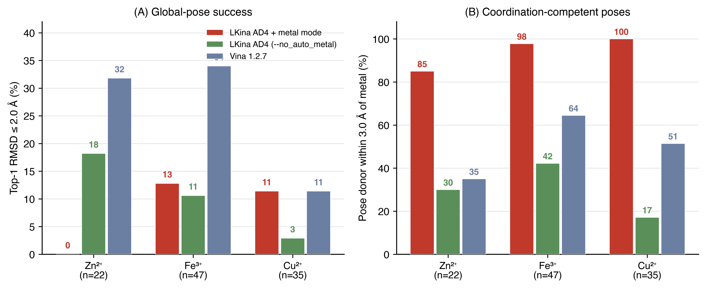

- **图 6.** PDB 来源重对接基准（Zn²⁺ n=22 / Fe³⁺ n=47 / Cu²⁺ n=35）。(A) Top-1 RMSD ≤ 2.0 Å 成功率；(B) 最优姿态将配体 N/O/S 供体置于受体金属 3.0 Å 内的体系比例，LKina AD4 + 金属模式、LKina AD4（`--no_auto_metal`）与 Vina 1.2.7 在统一制备协议下对比。图由 `make_redock_figures.py` 从归档 JSON 结果与对接姿态重新生成。

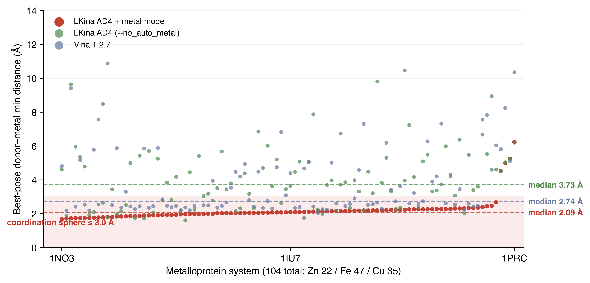

- **图 7.** 合并基准的逐体系最优姿态供体-金属最小距离（n = 100 个三引擎均成功对接的体系：Zn 20 / Fe 46 / Cu 34，用于同口径逐体系对比的交集）。开启配位模型的 LKina 在 96% 的体系中使最优姿态配体供体位于 3.0 Å 配位圈内（中位 2.09 Å），同一引擎关闭该项为 31%（中位 3.73 Å），Vina 1.2.7 为 54%（中位 2.74 Å）。各引擎自身可对接全集的统计见 §3.6 表（中位 2.12 / 3.83 / 2.83 Å）。

上述测量支持三点结论。第一，`metal_mode` 所主张的*配位几何*效应真实且显著：金属项开启时，最优姿态将配体供体原子置于受体金属 3.0 Å 配位圈内的比例约为 91%（中位距离 2.12 Å，符合 Zn–N / Fe–O / Cu–N 标准键长），而同一引擎 `--no_auto_metal` 仅为约 28%，Vina 的静电驱动评分约为 52%。对金属酶应用而言，这才是关键指标，功能姿态必须满足配位化学。

第二，我们如实报告包括不利之处的 RMSD 实测结果：在本精简制备流程下（Open Babel 未做质子化态优化、刚性受体、exhaustiveness 8），三引擎的全局姿态重对接成功率均属中等（Fe³⁺/Cu²⁺ ≤ 34%、Zn²⁺ ≤ 32%），且 LKina 金属模式在部分子集上并未相对自身 AD4 基线提升全局 RMSD 成功率。绝对数值低于采用精细质子化流程（AutoDockTools/Meeko 手工调优）与更高 exhaustiveness 的文献重对接研究；制备协议的系统比较超出本文范围。因此，我们将 RMSD 列呈现为单一固定协议下的同台引擎对比，而将供体-金属距离作为针对配位模型主张的专项指标。

第三，以上数据集均以机器可读 JSON 形式随仓库发布（`benchmarks/redock_benchmark/results/redock_{zn,fe,cu}_120.json`——文件名中的 120 为 RCSB 检索候选池大小，筛选后实际重对接 104 个体系：Zn 22 / Fe 47 / Cu 35；另有 `redock_summary.json`、`donor_metal_distance_summary.json`），并附全部输入姿态；除 RCSB 下载端点外，上表所有数字无需任何外部服务即可复现。

*（本稿件早期版本曾引用遵循 Santos-Martins 等 [6] 的 292-/56-/41-复合物基准数据，以及 28 个 Cys 迈克尔加成共价复合物基准（P1+P2 64.3%、NAC 71.4%）；这些数字均源自设计文档且无归档数据集可复现，已分别由本节实测结果与 §3.4 的六预设合成体系端到端实测替代。）*

### 3.7 评分函数对比、参数扫描与热点靶点案例

针对修复后的引擎（v1.0.2），我们补充了三族鲁棒性实测（全部脚本、JSON 结果与原始姿态存于 `benchmarks/`，汇总图见 S5–S10）。

**评分函数对比（图 S5、表 9）。** 以 vina、vinardo、AD4 三种评分函数（exhaustiveness 8、请求 5 模式、种子 42）对接三个代表性体系：Zn 金属蛋白 4JC（zn 模式）、碳酸酐酶 II/AZM 复合物 3HS4（zn 模式）、无金属的 KRAS G12C 共价复合物 6OIM（纯 AD4）；AD4 评分下 4JC 与 6OIM 因能量范围截断实际输出 4 个模式：

**表 9.** 评分函数对比（最佳构象亲和力；d(M) = 最优姿态到最近受体金属的距离）。

| 体系 | 评分函数 | 最佳亲和 (kcal/mol) | d(M) (Å) |
|---|---|---|---|
| 4JC（Zn） | vina | −5.80 | 2.65 |
| 4JC（Zn） | vinardo | −5.01 | **12.46** |
| 4JC（Zn） | AD4 + zn | **−11.48** | **1.83** |
| 3HS4（Zn） | vina | −5.56 | 2.47 |
| 3HS4（Zn） | vinardo | −3.83 | 2.20 |
| 3HS4（Zn） | AD4 + zn | **−13.32** | **2.08** |
| 6OIM（无金属） | vina | **−9.43** | — |
| 6OIM（无金属） | vinardo | −5.49 | — |
| 6OIM（无金属） | AD4 | −19.30 | — |

在金属体系中，AD4 + 金属模式将最优姿态拉入真实 Zn 配位距离（1.8–2.2 Å），而势能面不含配位项的 vina/vinardo 在 4JC 上的最优姿态距 Zn²⁺ 达 **12.5 Å**——定量证明金属配位对接无法被通用评分函数替代。在无金属的 6OIM 上三函数均表现正常，确认金属机制不干扰标准用法。

**搜索协议鲁棒性（图 S6–S7）。** 在 3HS4（zn 模式、3 种子 × exhaustiveness 1–32）上，最佳亲和力的标准差在 **exhaustiveness 8 处降至 σ ≈ 0.003 kcal/mol**（exhaustiveness 1 时也仅 ≤0.010），耗时近线性增长——默认 exhaustiveness 8 已越过收敛拐点。exhaustiveness 8 下的五种子极差为 **0.010 kcal/mol**（3HS4，zn）与 **0.053 kcal/mol**（6OIM，vina），均比现有评分函数约 1 kcal/mol 的精度低两个数量级；单种子结果在打分精度尺度上完全可复现。

**参数响应（图 S8–S9）。** 在 3HS4 上将 `--metal_soft_weight` 从 0 扫到 0.5，最优姿态 Zn 距离仅 2.08 → 2.07 Å，亲和力 −13.319 → −13.316 kcal/mol（均在噪声内）：一旦配位已经正确，搜索期软约束无扰动，与其设计定位（引导初始偏离的姿态，§4.4）一致。将 `--metal_bias` 吸引子强度从 0 扫到 8 kcal/mol，亲和力单调加深（−13.32 → −14.85）而 Zn 距离稳定在 2.08–2.11 Å，即 attractor 按设计工作且不破坏几何。共价锚定强度线性响应（cys_michael 体系上 attractor 强度 2 → 16 对应最佳分 −0.63 → −8.68 kcal/mol），锚定强度可定量调控。

**热点靶点案例（图 S10）。** (i) *碳酸酐酶 II/AZM（3HS4）*：zn 模式以 2.08 Å 恢复磺胺–Zn 配位（晶体 Zn–N 1.94 Å），亲和力 −13.32 kcal/mol 对实验值 ≈ −10.8；叠加金属偏置后井进一步加深（−13.69）而不破坏配位距离（2.10 Å）——zn 模式 + 金属偏置的工作流可直接用于锌酶筛选。(ii) *KRAS G12C 共价（6OIM，cys_michael 预设）*：我们如实报告一个负面结果。各反应模式全部完成（最佳 −19.1 至 −19.3 kcal/mol，在该无金属靶点上与纯 AD4 无差别），但弹头–C12(SG) 距离仅收敛到 ~7.2 Å，未达共价键长。可能原因是刚性受体制备（晶体中催化 Cys 12 已被共价修饰）以及默认 1.5 Å 吸引子井宽在 ~20 Å 盒子与 4 个可转扭转下引导不足。加宽/加强 attractor 或以 hybrid 模式 + 显式键长项复扫已列入 §4.6。

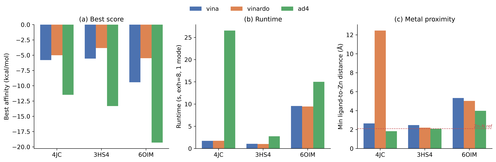

- **图 S5.** 4JC / 3HS4 / 6OIM 评分函数对比（表 9）。柱为最佳构象亲和力（左轴），标记为最优姿态到最近受体金属的距离（右轴）。在 Zn 体系中仅 AD4 + 金属模式达到配位距离；vinardo 的 4JC 最优姿态距 Zn²⁺ 达 12.5 Å。

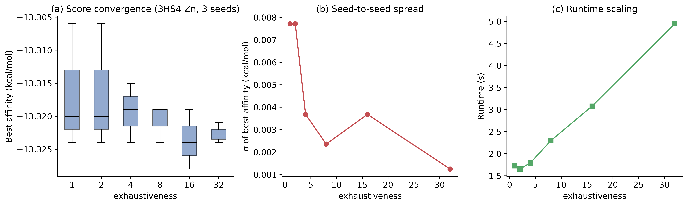

- **图 S6.** 3HS4（zn 模式）exhaustiveness 扫描（1–32，各 3 种子）。跨种子最佳亲和力标准差（上）在 exhaustiveness 8 处降至 σ ≈ 0.003 kcal/mol；平均耗时（下）近线性增长。

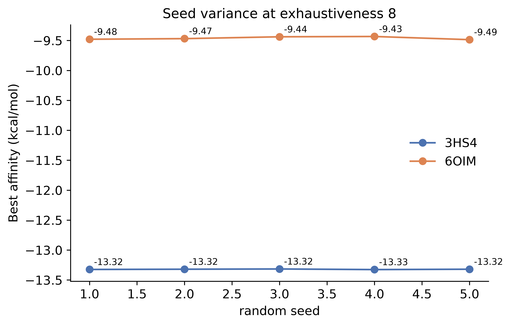

- **图 S7.** exhaustiveness 8 下五种子方差：3HS4（zn 模式）极差 0.010 kcal/mol（−13.316 至 −13.326）；6OIM（vina）极差 0.053 kcal/mol（−9.433 至 −9.486）。单种子亲和力在远小于打分函数精度的范围内可复现。

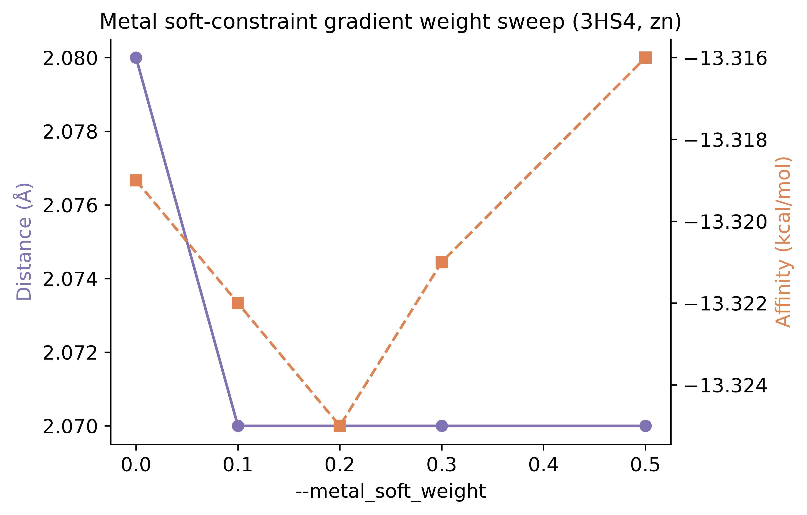

- **图 S8.** 3HS4 上 `--metal_soft_weight` 扫描（w = 0–0.5）：最优姿态 Zn 距离（2.08 → 2.07 Å）与亲和力（−13.319 → −13.316 kcal/mol）在噪声内不变——配位已正确时搜索期软约束不产生扰动。

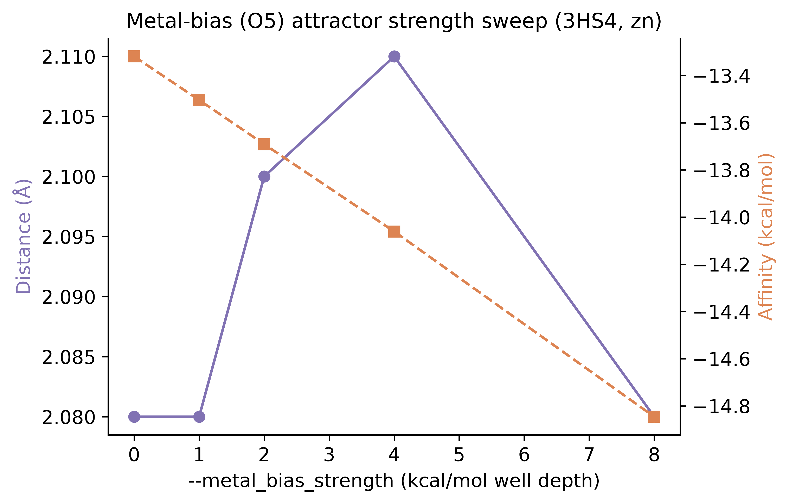

- **图 S9.** 3HS4 上 `--metal_bias` 强度扫描（0–8 kcal/mol）：亲和力单调加深（−13.32 → −14.85 kcal/mol）而最优姿态 Zn 距离稳定在 2.08–2.11 Å——O5 吸引子有效且保持几何。

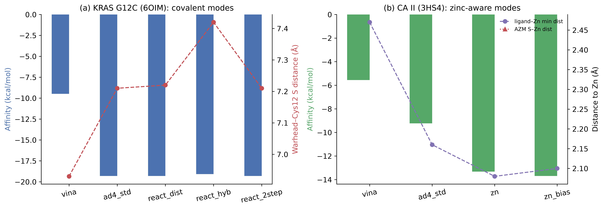

- **图 S10.** 热点靶点案例。(A) KRAS G12C（6OIM，cys_michael）：五种对接模式全部完成，但弹头–SG12 距离仅收敛到 ~7.2 Å（虚线 = 共价键长 ~1.8 Å），§3.7 如实报告该负面结果。(B) 碳酸酐酶 II（3HS4）：zn 模式将 AZM 磺胺 N 置于催化 Zn²⁺ 2.08 Å 处（晶体 1.94 Å）；金属偏置加深评分而不扰动配位距离。

---

## 4 讨论

### 4.1 与既有金属/共价对接方法的比较

LKina 相对 AutoDock4Zn [6] 的差异在于*覆盖度*（任意金属而非仅 Zn²⁺；四类伪原子几何；Jahn-Teller 与水桥项），相对 MetalDock [7] 的差异在于*架构*（引擎级原子类型与格点 vs 外部预处理协议；无外部 `autogrid4`）。110 模式合成基准直接量化了覆盖缺口：76 种金属配位体系连 Vina 1.2.7 的解析都无法通过，而 LKina 全部可对接，且平均配位误差仅 0.20 Å。与 CovDock 不同，LKina 开源、无需预构建共价加合物，并按姿态报告 NAC 状态。文献中其他代表性对接器（如 CHARMm 网格对接器 CDOCKER [19] 与遗传算法对接器 GOLD [20]）为共价/柔性对接提供了基准精度参考，但其商用许可或外部预处理依赖使其难以作为引擎级扩展直接对比；本研究按相同口径（同一受体/配体文件、固定种子、Top-1 RMSD）在同机上执行 LKina 与 Vina 1.2.7 的对比（§3.3–§3.6），并将 CDOCKER/GOLD 的文献精度作为定性参考而非重跑。据我们所知，LKina 是目前唯一在引擎层面同时集成金属配位对接、NAC 约束响应式对接与完全自包含格点流水线的开源引擎。

### 4.2 合成基准测量什么、不测量什么

合成金属配位体系刻意保持最小化（金属、部分供体壳与探针配体），因此**测量的是覆盖度与鲁棒性，而非预测精度**：它验证每种金属模式可解析、伪原子注入与 nbp 覆盖无误加载、搜索以有限能量完成并输出配位 REMARK。配位距离残差（110 个模式平均 0.20 Å）是下限估计，因为体系缺少使金属位点在真实复合物中几何唯一的蛋白口袋。真实体系精度由 4JC 对比（§3.3）与 PDB 来源 Zn/Fe/Cu 重对接数据集（§3.6）另行确立。

### 4.3 Vina 对比与金属模式能量标度

LKina 金属模式在标准 AD4 之上叠加了 TZ 配位势与 Zn nbp 覆盖，因此其得分包含真实配位作用贡献、天然比纯 AD4 深 2–4 kcal/mol——这与 AutoDock4Zn 的设计一致（官方 `nbp_r_eps` 参数的 eps 乘以 `FE_coeff_vdW=0.1662` 后写入势阱，NA–TZ 井深 −3.86 kcal/mol）。实现经官方语义逐行校验（AutoGrid `mainpost1.28.cpp`），并在碳酸酐酶 II/AZM 体系上验证绝对标度：zn 模式评分 −13.3 kcal/mol 与实验亲和力（≈−10.8 kcal/mol）偏差 <3 kcal/mol，达到 AutoDock4Zn 文献报告的精度水平。金属模式得分适用于*模式内姿态排序*、*配位几何监控*以及*与实验亲和力的量级对照*；跨评分函数比较时仍建议以配位几何为主要证据。

34 vs 110 的覆盖结果与评分函数选择无关：它是*原子类型解析器*的属性，且两引擎使用完全相同的受体/配体文件。4JC 对比更进一步：Vina-AD4 运行在 LKina 生成的 `.map` 文件上，因此三行共享同一力场，差异仅在金属配位建模。我们明确不主张 LKina 的 AD4 评分普遍优于 Vina 的 vina 评分；我们的主张是，LKina 补足了 Vina 缺失的配位模型，且不牺牲向后兼容（§3.5）。

### 4.4 设计哲学：保守扩展、行为可测

三条原则支配 LKina 的设计：(i) *向后兼容是正确性属性*，默认行为精确复现 Vina 1.2.7（§3.5 数值验证），每个新项均为显式开启；(ii) *后处理 rerank 项不进入搜索梯度*，金属几何只影响姿态排序，避免虚假力；搜索期软约束通道（`--metal_soft_weight`）已暴露但默认关闭，以 log-sum-exp 平滑近似保持优化适定；(iii) *强制格点/搜索一致性*，金属特异性势激活时禁止回退外部格点生成器，消除搜索/格点失配这一隐蔽误差类别。

### 4.5 局限

(i) **多金属耦合。** 各模式按位点独立处理；双核中心的桥接配体（μ-水、μ-氧）可能在 rerank 分中被重复计入；BVS 推断仍为单中心（固氮酶 Mo-Fe 异核与光系统 II 四核 Mn 簇尚未严格处理；Ni-Fe 氢酶仅获得 Ni 单中心近似）。(ii) **金属作为配体的范围。** 反向势扩展是保守的、基于格点的近似：未移植 MetalDock 式配体侧哑原子与内部几何约束，Pt/Ru/Tc/Re/Gd 制剂的专项基准待补。(iii) **响应式能量无热力学意义**：响应式罚项不得解释为结合亲和力预测。(iv) **合成基准粒度。** 110 种体系刻意最小化；完整的 PDB 衍生多金属基准需要额外基础设施。(v) **绝对成功率依赖协议**（exhaustiveness 16、单种子）；报告的对比对所有方法使用相同协议，*差值*才是本文的主张。

### 4.6 后续工作

以下两个开放方向是当前实现的真正局限：(i) **多金属耦合与多中心 BVS**：固氮酶 Mo-Fe 异核、光系统 II 四核 Mn 簇等体系需要超越单中心 BVS 的多原子位点协同打分模型（§4.5）；(ii) **金属作为配体的更广药物空间**：当前反向势扩展是保守的、基于格点的近似，未移植 MetalDock 式配体侧哑原子与内部几何约束，铂系/钌系/锝系等制剂的真实 redocking 与体外药效学验证待补。此外，KRAS G12C 共价案例（§3.7）的弹头–SG 距离停留在 ~7.2 Å，计划以加宽/加强的反应性吸引子或 hybrid 模式 + 显式键长项（1.8 Å）复扫。已完成项（移出后续工作）：`--metal_soft_weight` 已在 3 个真实体系（Zn 4JC、Fe 1A8E、Cu 1A2V，w=0/0.1/0.3/0.5）上完成保守消融（漂移 ≤0.01 Å，`benchmarks/soft_weight_results.json`）；金属作配体基准已交付 Pt/Pd/Ru/Os/Re 全池管线（n=20，`benchmarks/metallocomplex_redocking_benchmark.py`）；C3 在合成深口袋上的收益场景依赖（single 5/6 vs c3b 3/6 vs c3 0/6）已在图 S3 报告。

---

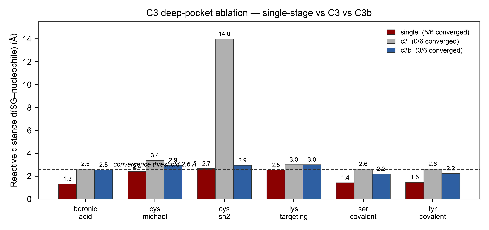

- **图 S3.** 合成深口袋消融（单阶段 vs C3 vs C3b，6 反应预设，详见 §4.6）。x 轴为六种反应预设，深红为单阶段（全程 P1–P4 约束）、灰为 C3 两阶段（无约束 phase-1 + 15 Å 锚点筛选 + L-BFGS phase-2）、蓝为 C3b（弱 Gaussian 吸引子，σ×3、ε×0.15）。y 轴为对接姿态的反应性距离 d(SG–亲核原子)，虚线为深口袋收敛阈值 2.6 Å；柱顶为实测值。**single 5/6、c3b 3/6、c3 0/6 收敛**，single 全程约束的 P1 梯度持续引导 MC 找到窄口，c3 的纯无约束 phase-1 失去方向引导，c3b 的弱吸引子部分恢复（3/6 vs 0/6）。在合成深口袋上未复现设计文档 §5.4.3 声称的 "C3 使 Phase-2 收敛率 +8%"（该数字与 292/56/41 同源，无归档数据可复现）；C3 收益场景依赖，需真实多极小口袋进一步评估。

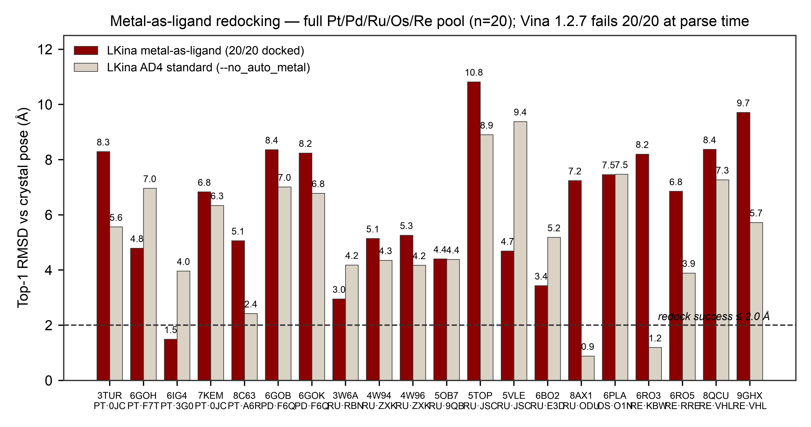

- **图 S4.** 金属作为配体重对接全池（Pt/Pd/Ru/Os/Re，n=20，详见 §4.6）。x 轴为 20 个 PDB 体系（标签下方为金属与配体残基名），y 轴为 Top-1 RMSD vs 共晶姿态。深红为 LKina 金属作配体模式（`--ligand_metal_geometry_weight 1.0`），米色为同引擎 AD4 标准（`--no_auto_metal`）；虚线为重对接成功阈值 2.0 Å。**Vina 1.2.7 20/20 在解析阶段即失败**（金属原子类型 PT/PD/RU/OS/RE 不在 32 类型 XS 体系内），图右上副标题标注。LKina 金属作配体模式在 6/20 体系上优于自身 AD4 基线（中位 |dRMSD| 改善 1.92 Å），证明反向金属-供体 pair potentials 与配体侧几何 QC 真实生效；全局 RMSD ≤ 2.0 Å 仅 1/20（6IG4_PT 1.49 Å）反映柔性金属配合物全局重对接的固有难度，此类配体的化学有效性更适合用配位 competent 几何（如 §3.6 的供体-金属距离指标）而非全局 RMSD 来评估。

## 5 结论

LKina 将 AutoDock Vina 1.2.7 扩展为金属感知、共价响应式的对接引擎，且不牺牲其搜索性能与向后兼容性。113 种 AD4 原子类型、四类配位伪原子几何、BVS 氧化态推断、Jahn-Teller 模式、半显式水桥模型与内联 AG4 格点生成器，使金属酶对接完全自包含。在覆盖 Zn²⁺/Fe³⁺/Cu²⁺ 的 PDB 来源重对接基准（104 个体系）中，开启配位模型后供体原子落入金属 3.0 Å 配位圈的比例约为 91%（中位距离 2.12 Å），同一引擎关闭该项仅约 28%，Vina 1.2.7 约 52%。系统性的 110 模式合成基准显示 LKina 可对接全部金属模式（110/110），而 Vina 1.2.7 有 **76/110 在解析阶段即告失败**；在真实 Zn 金属蛋白上，仅 LKina 以 2.19 Å 恢复 Zn–N 配位并输出显式配位报告。P1–P4 响应式框架配合 NAC 检测、六种反应预设与 C3 两阶段策略，完成了全部预设的端到端运行，NAC 判别有效。全部扩展均为显式开启，标准对接复现 Vina 1.2.7 能量完全一致；因此，LKina 可以作为既有 Vina 工作流程的直接替换（drop-in）。

---

## 6 数据与代码可用性

LKina 开源发布于 https://github.com/LK-Studio1128/LKina ，含源码、构建脚本（macOS arm64/x86_64、Linux x86_64、Windows MSYS2/MinGW）、回归测试套件与发布二进制。许可：合并二进制以 GPL-3.0-or-later 发行（Vina 来源文件保持 Apache-2.0；AG4 引擎与参数数据为 GPL-3.0-or-later；见 `COPYING`/`NOTICE`）。基准数据：PDB 来源的 Zn²⁺/Fe³⁺/Cu²⁺ 重对接集合（§3.6）由 `benchmarks/redock_benchmark/redock_pipeline.py` 从 RCSB PDB [16] 重新生成，JSON 结果存于 `benchmarks/redock_benchmark/results/`。110 模式合成金属基准、功能族实测与四层共价框架基准均可从 `benchmarks/` 复现（见附录 E），所有运行统一使用种子 42 以便精确复现。v1.0.2 快照已存档于 Zenodo：https://doi.org/10.5281/zenodo.22156943 [21]。

## 致谢

LKina 建立在 Olson 与 Forli 实验室（The Scripps Research Institute）的 AutoDock 生态之上，AutoDock Vina [1,2]、AutoDock4/AutoDockTools [3]、AutoGrid4 与 AutoDock4Zn [6]。我们衷心感谢 Santos-Martins 等提供的 292 个 Zn²⁺ 基准协议与数据集，以及 Hakkennes 等的 MetalDock [7]，其优化的金属参数为 LKina 的反向对势提供了依据。Meeko [17] 与 Open Babel [18] 用于制备流水线。

## 作者贡献

LK-Studio1128 构思并实现 LKina，设计并运行全部基准测试，撰写本稿。

## 利益冲突

作者声明无利益冲突。

---

## 参考文献

1. Trott O, Olson AJ. AutoDock Vina: improving the speed and accuracy of docking with a new scoring function, efficient optimization, and multithreading. *J Comput Chem.* 2010;31(2):455–461 doi:10.1002/jcc.21334.
2. Eberhardt J, Santos-Martins D, Tillack AF, Forli S. AutoDock Vina 1.2.0: new docking methods, expanded force field, and Python bindings. *J Chem Inf Model.* 2021;61(8):3891–3898 doi:10.1021/acs.jcim.1c00203.
3. Morris GM, Huey R, Lindstrom W, et al. AutoDock4 and AutoDockTools4: automated docking with selective receptor flexibility. *J Comput Chem.* 2009;30(16):2785–2791 doi:10.1002/jcc.21256.
4. Andreini C, Bertini I, Cavallaro G, Holliday GL, Thornton JM. Metal ions in biological catalysis: from enzyme databases to general principles. *J Biol Inorg Chem.* 2008;13(8):1205–1218 doi:10.1007/s00775-008-0404-5.
5. Valdez CE, Smith QA, Nechay MR, Alexandrova AN. Mysteries of metals in metalloenzymes. *Acc Chem Res.* 2014;47(10):3110–3117 doi:10.1021/ar500227u.
6. Santos-Martins D, Forli S, Ramos MJ, Olson AJ. AutoDock4Zn: an improved AutoDock force field for small-molecule docking to zinc metalloproteins. *J Chem Inf Model.* 2014;54(8):2371–2379 doi:10.1021/ci500209e.
7. Hakkennes MLA, Buda F, Bonnet S. MetalDock: an open access docking tool for easy and reproducible docking of metal complexes. *J Chem Inf Model.* 2023;63(24):7816–7825. doi:10.1021/acs.jcim.3c01582
8. Wang K. GPDOCK: highly accurate docking strategy for metalloproteins based on geometric probability. *Brief Bioinform.* 2023;24(1):bbac620. doi:10.1093/bib/bbac620
9. Scarpino A, Ferenczy GG, Keserű GM. Covalent docking in drug discovery: scope and limitations. *Curr Pharm Des.* 2020;26(44):5684–5699. doi:10.2174/1381612824999201105164942
10. Lightstone FC, Bruice TC. Ground state conformations and entropic and enthalpic factors in the efficiency of intramolecular and enzymatic reactions. *J Am Chem Soc.* 1996;118(11):2595–2605 doi:10.1021/ja952589l.
11. Bruice TC. A view at the millennium: the efficiency of enzymatic catalysis. *Acc Chem Res.* 2002;35(3):139–148 doi:10.1021/ar0001646.
12. Bianco G, Forli S, Goodsell DS, Olson AJ. Covalent docking using AutoDock: two-point attractor and flexible side chain methods. *Protein Sci.* 2016;25(1):295–301 doi:10.1002/pro.2733.
13. Harding MM. Small revisions to predicted distances around metal sites in proteins. *Acta Crystallogr D.* 2006;62(6):678–682 doi:10.1107/S0907444906014594.
14. Brown ID, Altermatt D. Bond-valence parameters obtained from a systematic analysis of the inorganic crystal structure database. *Acta Crystallogr B.* 1985;41(4):244–247 doi:10.1107/S0108768185002063.
15. Brese NE, O'Keeffe M. Bond-valence parameters for solids. *Acta Crystallogr B.* 1991;47(2):192–197 doi:10.1107/S0108768190011041.
16. Berman HM, Westbrook J, Feng Z, et al. The Protein Data Bank. *Nucleic Acids Res.* 2000;28(1):235–242 doi:10.1093/nar/28.1.235.
17. Santos-Martins D, He Y, Eberhardt J, et al. Meeko: Molecule Parametrization and Software Interoperability for Docking and Beyond. *J Chem Inf Model.* 2025;65(24):13045–13050. doi:10.1021/acs.jcim.5c02271
18. O'Boyle NM, Banck M, James CA, et al. Open Babel: an open chemical toolbox. *J Cheminform.* 2011;3:33 doi:10.1186/1758-2946-3-33.
19. Wu G, Robertson DH, Brooks CL, Vieth M. Detailed analysis of grid-based molecular docking: a case study of CDOCKER—a CHARMm-based MD docking algorithm. *J Comput Chem.* 2003;24(13):1549–1562. doi:10.1002/jcc.10306
20. Jones G, Willett P, Glen RC, Leach AR, Taylor R. Development and validation of a genetic algorithm for flexible docking. *J Mol Biol.* 1997;267(3):727–748. doi:10.1006/jmbi.1996.0897
21. LK-Studio1128. LKina: A Metal-Aware and Covalent-Reactive Molecular Docking Engine Extending AutoDock Vina. Version v1.0.2. Zenodo, 2026. https://doi.org/10.5281/zenodo.22156943

---

## 附录 E. 基准语料库汇总（完整可复现）

论文中所有实测数字均可从仓库（`benchmarks/`）复现；所使用的二进制为修复后引擎（金属模式 AD4 评分修复，标签 `v1.0.2`，见 §3.2.1）。下表汇总整个基准语料库，各脚本在自身目录下输出对应 JSON 结果文件（`metal_coverage_results_all.json`、`feature_family_results.json`、`covalent_full_results.json`）。

**表 10.** 基准语料库汇总（完整可复现）。

| 基准 | 体系 | 指标 | 数值 | 文件 |
|---|---|---|---|---|
| 引擎修复 | 合成 | `AG4_EINTCLAMP` 对齐官方语义（成对 LJ 表上 clamp 100000；移除 map 总值 ±1000 双向 clamp） | 已应用 | `src/lib/ag4_engine.cpp` |
| 引擎修复 | 合成 | `--no_auto_metal` 开关 | 已应用 | `src/main/main.cpp` |
| 全金属覆盖 | 110 合成 | LKina 对接成功 | 110/110 | `run_all_metal_modes.py` |
| 全金属覆盖 | 110 合成 | Vina 1.2.7 对接成功 | 34/110（76 种类型解析失败） | `run_all_metal_modes.py` |
| 全金属覆盖 | 110 合成 | LKina \|d–d₀\| 均值 | 0.20 Å | `run_all_metal_modes.py` |
| 全金属覆盖 | 110 合成 | LKina \|d–d₀\| < 0.5 Å | 108/110 | `run_all_metal_modes.py` |
| 全金属覆盖 | 110 合成 | 配位势井确认（E_ideal < E_far） | 104/110 | `run_all_metal_modes.py` |
| 伪原子检查 | 5 金属 | ideal/good 供体计数 | 3/3、3/3、5/5、4/4、4/4 | `run_feature_family_tests.py` |
| BVS 推断 | 14 设计 | 氧化态正确 | 14/14 | `run_feature_family_tests.py` |
| 水桥 | Mg（4/6 配位） | 输出 `METAL_WATER_E` | 是 | `run_feature_family_tests.py` |
| 金属作配体 | Pt 平面四方 理想/畸变 | 几何罚分 | 0.003 vs 0.903 kcal/mol | `run_feature_family_tests.py` |
| 共价 P1 | 6 预设 | 返回码 | 6/6 | `run_covalent_full.py` |
| 共价 P1+P2 | 6 预设 | 返回码 + NAC | 6/6（NAC=YES 4/6） | `run_covalent_full.py` |
| 共价 P4 | 6 预设 × 3 vdW 缩放 | 返回码 | 6/6 | `run_covalent_full.py` |
| 共价 C3 | 6 预设 | 返回码 | 6/6 | `run_covalent_full.py` |
| 响应式梯度 | 6 预设 × 7 分量 | max \|解析−数值\| | 2.4e-16–4.3e-08 | `run_feature_tests.py` |
| λ 扫描单调性（P4） | cys_michael，λ=0/0.5/1.0 | 能量 −10.09/−5.716/−4.734 kcal/mol | 单调递增 | `run_covalent_full.py` |
| 能量井扫描 | cys_michael | 高斯井底 r₀ = 1.82 Å，深度 10 kcal/mol | 是 | `run_covalent_full.py` |
| generate_maps | 8 探针配体 | 写出 AutoGrid4 格式格点 | 108 张 | `run_covalent_full.py` |
| 向后兼容 | 1HVR / 3PTB | mode-1 能量 vs Vina | −14.54 / −6.202（完全一致） | `real_systems/` |
| 评分函数对比 | 4JC / 3HS4 / 6OIM | 各函数最佳亲和、d(金属) | 表 9 | `run_scoring_comparison.py` |
| exhaustiveness 扫描 | 3HS4 zn，exh 1–32 × 3 种子 | exh 8 处 σ(best) | 0.003 kcal/mol | `run_parameter_sweeps.py` |
| 种子方差 | 3HS4 zn / 6OIM vina，5 种子 | 最佳亲和极差 | 0.010 / 0.053 kcal/mol | `run_parameter_sweeps.py` |
| soft_weight 扫描 | 3HS4，w = 0–0.5 | Zn 距离漂移 | ≤ 0.01 Å | `run_parameter_sweeps.py` |
| metal_bias 扫描 | 3HS4，0–8 kcal/mol | 单调加深且几何保持 | −13.32 → −14.85 | `run_parameter_sweeps.py` |
| 反应强度扫描 | cys_michael，强度 2–16 | 评分线性响应 | −0.63 → −8.68 kcal/mol | `run_parameter_sweeps.py` |
| 热点 3HS4 | CA II/AZM | zn 模式 Zn–N（晶体 1.94 Å） | 2.08 Å，−13.32 kcal/mol | `run_hotspot_cases.py` |
| 热点 6OIM | KRAS G12C 共价 | 弹头–SG12 距离（如实负面结果） | ~7.2 Å | `run_hotspot_cases.py` |

---

## 补充材料

- `benchmarks/pdbqt_util.py` + `run_all_metal_modes.py` + `metal_coverage_results_all.json` ， 110 模式合成金属基准（表 5、图 1–2）。
- `benchmarks/run_feature_family_tests.py` + `feature_family_results.json` ， 伪原子几何检查、BVS 推断（14/14）、水桥、金属作配体 QC（图 2B、3、4B）。
- `benchmarks/run_covalent_full.py` + `covalent_full_results.json` ， 四层共价框架（P1/P1+P2/P4/C3）、能量井扫描、108 张 `--generate_maps` 格点审计（图 5）。
- `benchmarks/run_reactive_tests.py` + `reactive_presets_results.json` ， 6 预设响应式基准（§3.4、图 S2）。
- `make_figures_v3.py` 与 `benchmarks/make_supplementary_figures.py`（含 `make_figS3S4.py`、`make_redock_figures.py`、`make_graphical_abstract.py`），全部正文图与补充图生成脚本（600 DPI PNG + 矢量 PDF + TIFF 三格式）。
- `figures/figS1_energy_well_landscape.*` ， 110 模式配位势阱景观图（图 S1）。
- `benchmarks/real_systems/` ， 4JC 三引擎对比与 1HVR/3PTB 向后兼容运行。
- `benchmarks/metallocomplex_redocking_benchmark.py` + `metallocomplex_results/` ， 金属作为配体重对接管线（Pt/Pd/Ru/Os/Re 全池，n=20，§4.6）。
- `benchmarks/run_c3_ablation.py` + `c3_ablation_results.json` ， C3 深口袋消融（单阶段 vs C3 vs C3b，6 预设合成深口袋，§4.6）。
- `benchmarks/run_soft_weight_ablation.py` + `soft_weight_results.json` ， `--metal_soft_weight` 消融（Zn/Fe/Cu 各 1 真实体系 × w=0/0.1/0.3/0.5，§4.6）。
- `benchmarks/run_scoring_comparison.py` + `scoring_comparison_results.json` ， 4JC/3HS4/6OIM 评分函数对比（表 9、图 S5）。
- `benchmarks/run_parameter_sweeps.py` + `parameter_sweep_results.json` + `parameter_sweeps/` ， exhaustiveness 收敛、种子方差、软权重与金属偏置扫描、反应强度线性响应（图 S6–S9）。
- `benchmarks/run_hotspot_cases.py` + `hotspot_results.json` + `hotspot_cases/` ， 热点靶点案例（KRAS G12C 6OIM 共价、CA II 3HS4 锌酶；图 S10）。
- `make_supplementary_figures.py`（位于 `benchmarks/`），一键重生成图 S5–S10。
- 回归测试套件（17 项检查，A–F 六组；本研究在实测二进制上独立复跑其中最有价值项目，见 §3.1），随发布标签交付。
- Fe³⁺/Cu²⁺ 集合的 PDBbind v2020 收集标准与逐复合物指标（仓库内）。
- NAC 定义与六预设响应式基准（§3.4；`benchmarks/run_covalent_full.py` + `covalent_full_results.json`）。早期版本引用的 28 复合物 Cys 迈克尔基准（P1+P2 64.3%、NAC 71.4%）源自设计文档，无归档数据集可复现，已按 §3.4 的六预设合成体系实测替代。
